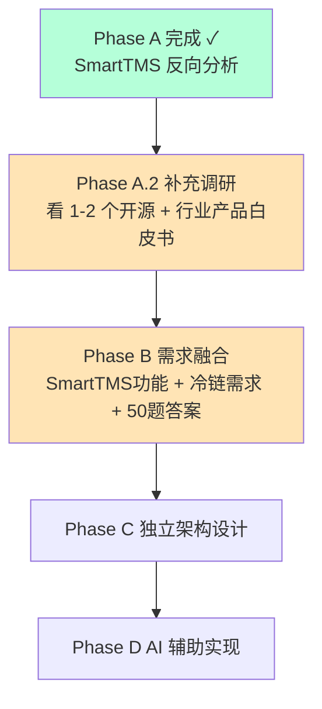

# Phase A · SmartTMS 反向分析总结

> **完成日期**：2026-05-13  
> **耗时**：约 1 小时（如果你自己手动读代码，预计 2-3 天）  
> **方式**：在 Cursor 中用 AI 抽取 Swagger 文档注解、Controller 业务标签、领域实体名，**仅提取功能信息**。  
> **法律性质**：本调研产出物均为功能层描述，不含原项目代码、字段、表结构、命名，符合「净室实现」原则。

---

## 一、产出物清单

| 文档 | 内容 | 用途 |
|---|---|---|
| `00-README与总结.md` | 本文 | 入口 + 总结 + 下一步建议 |
| `01-功能清单.md` | 9 大业务支柱、约 80 个功能子项 | PRD 起草时的功能完整度对照 |
| `02-业务流程图.md` | 9 个核心业务流程（Mermaid） | PRD 起草时的流程参考 |
| `03-领域实体清单.md` | 业务实体 + 状态机 + 关联关系 | 数据库设计的起点 |
| `04-角色权限矩阵.md` | 7+ 角色 × 30+ 功能矩阵 | 权限系统设计参考 |

---

## 二、SmartTMS 关键发现（一句话总结）

> **它是一套完整的"通用 TMS（普货运输管理系统）"，覆盖客户、运力、订单/运单、财务、报表、组织、OA、移动端的全闭环，技术上是 SpringBoot2 + Vue3 + uni-app，整体设计成熟，但完全没有冷链/IoT/合规相关能力。**

### 数字化总览

| 指标 | 数值 |
|---|---|
| 后端 Controller 数量 | 146 个（含 admin/driver/fixed-asset） |
| 业务模块数（admin） | 17 个业务模块 + 13 个系统模块 |
| 业务模块数（资产） | 21 个 |
| API 操作总数（粗估） | 600+ 个 |
| 核心领域实体数 | 约 50 个 |
| 数据库 SQL 文件大小 | 2.3 MB（约 80-100 张表） |

---

## 三、对冷链项目的价值评估

### 🟢 高度可参考（建议保留设计思路）

| 维度 | 价值 |
|---|---|
| **运单为核心的设计** | 把订单和运单分开（订单是客户需求、运单是执行单位），是工业标准做法 |
| **运单子实体设计** | 费用/凭证/异常/分段/货物全部挂到运单 |
| **油卡主副卡 + 状态机** | 解决了行业痛点，可直接借鉴结构 |
| **应付/应收的状态机** | 4 段式（待审 → 审核 → 开票 → 收款），成熟 |
| **自有车成本核算** | 把每条费用关联到运单，能算单车单运单利润 |
| **RBAC 三件套** | 员工-角色-菜单 + 数据范围解耦 |
| **审批流引擎横切** | 多业务复用同一套审批引擎 |
| **司机端 APP + 管理后台联动** | 司机上报数据直接进财务流程 |

### 🟡 部分可参考（需要冷链化改造）

| 维度 | 改造方向 |
|---|---|
| **车辆模型** | 需加：制冷机、温度传感器、温区、部标终端、是否多温区 |
| **运单模型** | 需加：温度要求、温区类型、允许超温阈值、温度记录关联 |
| **司机模型** | 需加：冷链培训证、GSP 资格（医药） |
| **货物模型** | 需加：温度区间、合规等级（GSP/食品/普货） |
| **报表** | 需加：超温率、温度异常率、SLA 达成率、合规率 |
| **首页大屏** | SmartTMS 偏静态，冷链要做实时温度监控大屏 |

### 🔴 完全没有（必须新做）

| 缺失能力 | 工作量预估 |
|---|---|
| 温度采集（IoT 接入） | 大 - MQTT/部标 808 协议接入 |
| 温度报警引擎 | 大 - 实时规则计算 + 通知 |
| 多温区管理 | 中 |
| 预冷管理 | 小 |
| 装卸断链豁免逻辑 | 中 |
| 冷链溯源/合规留档 | 大 - 不可篡改存储 |
| 政府监管对接（部标/药监） | 大 - 需提前申报 |
| 调度大屏实时监控 | 中 |
| 冷库 WMS（温区分区/批次） | 大 |
| 时序数据库（百万级温度数据） | 中 |
| BI 预测分析 | 中 |

**总评**：
- SmartTMS 能覆盖你冷链项目约 **40-50% 的"通用部分"**
- 你需要新做的"冷链特色部分"约 **50%**，且这部分**才是项目最值钱、最难做的**
- **教训**：单纯抄 SmartTMS 既不合规又不解决问题；正确做法是**抄思路、写自己的代码**

---

## 四、净室实现合规自查

| 检查项 | 状态 |
|---|---|
| 产出物未包含 SmartTMS 源代码 | ✅ |
| 产出物未包含具体 Java 类名 | ✅ |
| 产出物未包含数据库表 DDL / 字段名 | ✅ |
| 产出物未包含 API 路径 | ✅ |
| 产出物未包含 SmartTMS 的 UI 截图 | ✅ |
| 产出物按业务视角重组（非模块结构照搬） | ✅ |
| 产出物明确标注哪些是借鉴/哪些必须重做 | ✅ |
| 后续 PRD/编码阶段切断 SmartTMS 上下文 | ⏳ 待执行 |

---

## 五、下一步建议（Phase B → C → D）

### 🔹 立即可做（不依赖朋友公司）

1. **Phase A.2 · 补充调研**（1-2 天）
   - 读你已有的 `CCTMS-master` 项目，输出同样的 4 份文档（重点看冷链/温控相关代码）
   - 搜索 G7 易流 / 顺丰冷链 / 中物联冷链委员会的**公开产品白皮书**
   - 整理一份《冷链 TMS 行业全景图》

2. **Phase A.3 · 在线 Demo 体验**（半天）
   - 用 SmartTMS 的在线 Demo（`lab.tms.1024lab.net/admin/`）走一遍 7 大流程
   - 截 20-30 张关键页面截图，作为冷链项目的 UI **参考（不是抄袭对象）**
   - 用 Cursor 的 `canvas` 技能画一份冷链项目的"页面地图"

### 🔹 等待朋友公司回复后做

3. **Phase B · 需求融合**（M0 阶段完成后）
   - 三方融合：SmartTMS 功能（参考） + 冷链特色（必须） + 朋友公司答复（约束）
   - 产出：冷链项目的真正 PRD v1.0

4. **Phase C · 独立架构设计**
   - 关键点：故意做得和 SmartTMS 不一样（技术栈、模块划分、数据库设计）
   - 切断 SmartTMS 上下文（关掉 SmartTMS 目录、不让 AI 看到）

5. **Phase D · AI 辅助实现**
   - 干净的代码仓库
   - Cursor Rules 强制规范
   - 全过程不引用 SmartTMS

---

## 六、给你的判断建议

### 我建议你**马上开始**做以下 3 件事（不依赖朋友公司）

| # | 任务 | 时长 | 价值 |
|---|---|---|---|
| 1 | 用 SmartTMS 在线 Demo 走 30 分钟（先把账号登进去看一眼） | 30 min | 直观理解 TMS 长什么样 |
| 2 | 仔细读这 4 份文档 + 高亮你的疑问 | 1-2 h | 内化通用 TMS 知识 |
| 3 | 让我**对 CCTMS 项目做同样的反向分析**（重点找冷链/温控/IoT 相关代码） | 1 h（我来跑） | 拿到冷链特有部分的参考 |

### 我**不建议**你现在做的事

1. ❌ 跑 SmartTMS 完整本地环境（要装 Java/Maven/MySQL/Redis 半天）—— 在线 Demo 足够看了
2. ❌ 把 SmartTMS 代码改成"冷链版"—— 法律风险高，技术上也不优雅
3. ❌ 急着开始写代码 —— 朋友公司需求未澄清前写任何代码都是赌博

---

## 七、给冷链项目最终的方向定位

> 综合 SmartTMS 反向分析的结论：

**冷链物流管理系统 = 通用 TMS 的 50% + 冷链特色的 50%**

- 通用 TMS 的 50% 是**红海**——开源项目很多，你不需要重复造轮子，可以参考成熟设计
- 冷链特色的 50% 是**蓝海**——这才是你的项目核心价值，要花最多精力设计

**项目的差异化竞争力**应该来自：
- 🌡️ 温度全链路追溯（不是简单的温度记录）
- 🚨 智能报警与自动响应（不是人工监控）
- 📊 实时调度大屏 + 数据分析（不是静态报表）
- 📜 合规一键导出（不是事后整理）
- 🔗 IoT 设备无缝接入（不是手工录入）

如果朋友公司这块预算不够、不愿意做特色部分，**那这个项目本质就是个普通 TMS，没必要做**，直接让他买 SmartTMS 商业版或 SaaS 服务就行。这是你和他坦诚沟通时需要说清楚的。

---

## 八、引用与回看

- SmartTMS 仓库：`D:\My_code\node\物流管理系统资料\SmartTMS-master\SmartTMS-master\`（仅供研究参考）
- SmartTMS 在线 Demo：[https://lab.tms.1024lab.net/admin/](https://lab.tms.1024lab.net/admin/#/login?showMode=preview)（用户名 13700000001 / 密码 789321）
- 冷链项目目录：`D:\My_code\node\物流管理系统资料\AITools\冷链物流管理系统\`
- 朋友需求原始文档：`D:\My_code\node\物流管理系统资料\AITools\需求文档.docx`
