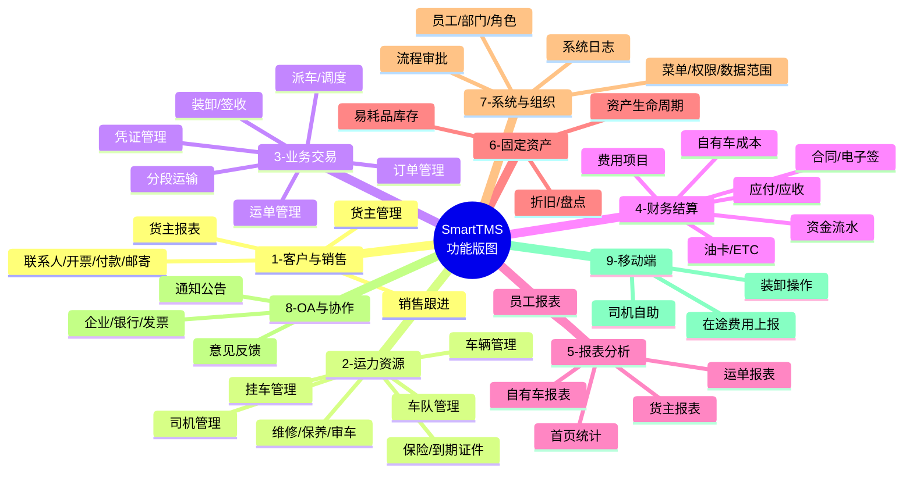
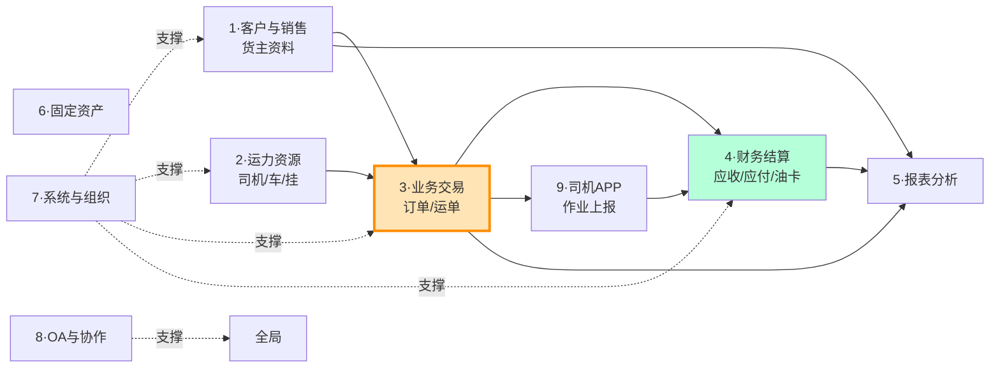

# SmartTMS 功能清单（反向抽取）

> **本文档性质**：基于公开开源项目 SmartTMS 进行的**功能层反向分析**，仅记录"用户能做什么"，不记录代码实现细节。  
> **目的**：作为冷链物流项目 PRD 的参考素材，理解一个**通用 TMS（普货运输管理系统）**应该具备的功能完整度。  
> **使用注意**：本文档按业务支柱重新组织（不按原项目模块结构），后续 PRD 编写应基于**自己的需求**重新设计，不要直接照抄此清单。

---

## 一、SmartTMS 功能版图（鸟瞰）

---

## 二、9 大业务支柱详细功能

### 支柱 1 · 客户与销售（货主管理）

**目标**：维护客户档案，跟进销售关系，沉淀客户资料。

| 功能子域 | 用户能做什么 |
|---|---|
| 货主档案 | 新建/编辑/查询/删除货主基本信息；按业务负责人、客服负责人分配；启用/禁用；导出 |
| 货主联系人 | 维护多个联系人，标记默认联系人 |
| 开票信息 | 维护多套发票抬头（普票/专票/电子发票） |
| 付款方式 | 维护多种结算方式（月结/票结/即时） |
| 邮寄地址 | 维护票据/物品邮寄地址 |
| 销售跟进 | 录入跟进记录（拜访/电话/邮件） |
| 客户报表 | 客户新增、客户下单、客户毛利、客户应收、客户日报、客户成本 |

### 支柱 2 · 运力资源（人车挂证）

**目标**：管理司机、车辆、挂车这三大核心资源，以及它们的合规证件。

| 功能子域 | 用户能做什么 |
|---|---|
| 司机管理 | 司机档案 CRUD、经营模式（外协/自有/个体）切换、状态启停、证件审核、银行账户管理、导出 |
| 车辆管理 | 车辆档案 CRUD、经营模式切换、启用/禁用、自有车筛选、关联车辆下拉、导出 |
| 挂车管理 | 挂车档案 CRUD、绑定车辆、批量管理、导出 |
| 车队管理 | 多个车辆组成的车队管理 |
| 维修管理 | 报修登记、维修地点维护、维修费用核算 |
| 保养管理 | 保养计划、保养记录 |
| 审车登记 | 年审到期提醒、登记审车记录 |
| 保险管理 | 商业险/交强险/承运险登记，到期提醒 |
| 到期证件 | 集中查看所有即将到期的证件（行驶证/驾驶证/营运证等） |

### 支柱 3 · 业务交易（订单 → 运单 → 签收）

**目标**：完成"客户下单到完成交付"的核心交易闭环。

| 功能子域 | 用户能做什么 |
|---|---|
| 订单管理 | 分页查询/新建/编辑订单；编辑时联动更新关联运单；取消订单；导出 |
| 运单管理 | 创建运单（一对一或一对多基于订单）、编辑运单、查询、详情、作废 |
| 派车调度 | 为运单分配司机/车辆/挂车；分段运输（中转）时分别分配；删除已分配信息 |
| 运输路线 | 配置运输路线模板；运单可更新所走路线 |
| 装卸货 | 装货操作、卸货操作（在司机端 APP 完成） |
| 凭证管理 | 上传/更新/删除运单凭证（装卸照片、磅单、签收单） |
| 回单与派车单 | 上传回单、上传派车单 |
| 箱号铅封 | 集装箱业务的箱号、铅封号维护 |
| 分段运输 | 一票多段时按段分配运力 |
| 标记完成 | 更新运单为"运输完成" |
| 费用维护 | 在运单维度维护各项费用（运费/在途费用） |
| 报表 | 运单利润、车辆运单、运营日报 |

### 支柱 4 · 财务结算

**目标**：管理钱的进出，对内对外结算。

| 功能子域 | 用户能做什么 |
|---|---|
| **应付管理** | 应付现金、应付油卡的核算与支付 |
| **应收管理** | 提交核算、应收核算、申请开票、应收核销、应收账款台账 |
| **合同管理** | 合同模板分类、新建/导入合同、状态管理、电子签章（e签宝）、合同预览/下载、撤销 |
| **费用项目** | 维护费用科目（运费/装卸费/过路费/油费/维修费等） |
| **资金流水** | 银行/现金流水台账 |
| **发票管理** | 开票申请、销项发票登记、进项发票登记 |
| **油卡管理** | 油卡 CRUD、充值、消耗、挂失圈回、副卡分配、油卡交易记录、导出 |
| **ETC 管理** | ETC 卡 CRUD、充值、消耗 |
| **自有车成本** | 自有车基本信息、期初期末、收入（现金/油卡）、支出（现金/油费/ETC/尿素）、费用列表（含审核）、费用分类、费用与运单关联 |

### 支柱 5 · 报表与分析

**目标**：从交易数据中提炼经营洞察。

| 报表类别 | 维度 |
|---|---|
| **首页统计** | 运营总览、首屏核心指标 |
| **货主报表** | 客户新增、客户下单、客户毛利、客户应收、客户日报、客服成本、客服日报、客服日推进 |
| **运单报表** | 运单利润、车辆运单、运营日报 |
| **自有车报表** | 自有车成本汇总、外调车油卡比例 |
| **员工报表** | 销售成本、销售日报、销售目标、销售应收、员工业务统计 |
| **资金报表** | 资金流水报表 |

### 支柱 6 · 固定资产管理

**目标**：管理公司固定资产（车辆以外的设备/物资）的全生命周期。

| 子域 | 功能 |
|---|---|
| 资产基础 | 存放位置维护、资产分类维护 |
| 资产登记 | 资产清单、资产采购入账 |
| 资产流转 | 领用、退还、借用、归还、调拨、转移 |
| 资产维护 | 维修登记、报废登记 |
| 资产核算 | 盘点、折旧明细、资产折旧计算 |
| 易耗品 | 易耗品库存、采购、领用、盘点、库存记录 |

### 支柱 7 · 系统与组织

**目标**：系统的"管理后台"，配置组织、人、权限。

| 子域 | 功能 |
|---|---|
| 员工管理 | 员工 CRUD、启用/禁用、批量调整部门、修改/重置密码、按部门查询 |
| 部门管理 | 部门树 CRUD、查询 |
| 角色管理 | 角色 CRUD、角色-员工绑定（增删查批量）、角色-菜单绑定、角色-数据范围设置 |
| 菜单管理 | 菜单 CRUD、菜单树查询、获取所有请求路径（用于权限点） |
| 数据范围 | 系统级数据范围配置（全公司/部门/本人） |
| 流程审批 | 审批流配置、运单/油卡/应付/应收/在途费用等流程实例管理 |
| 登录系统 | 普通登录、第三方登录 |
| 系统日志 | 登录日志、操作日志、更新日志 |

### 支柱 8 · OA 与协作

**目标**：员工日常协作工具。

| 子域 | 功能 |
|---|---|
| 通知公告 | 平台公告发布、消息推送、企业微信机器人通知 |
| 意见反馈 | 用户提交反馈、管理员处理 |
| 企业信息 | 企业档案、银行信息、发票信息 |
| 费用申请 | 员工费用申请、审批 |
| APP 相关 | APP 轮播图、APP 版本管理 |

### 支柱 9 · 移动端（司机端 APP）

**目标**：司机在外作业时的自助操作工具，与管理端实时联动。

| 子域 | 功能 |
|---|---|
| 司机自助 | 查看个人信息、余额、绑定车辆/挂车 |
| 银行账户 | 管理收款银行卡 |
| 运单作业 | 查看待办运单、运单详情、统计已完成数 |
| 凭证上传 | 装卸照片、磅单上传 |
| 在途费用上报 | 现金支出（修车/违章/住宿/停车）、ETC（卡/现金）、油费（卡/现金）、尿素（卡/现金） |
| 在途费用申请 | 现金出车款申请、油卡充值申请 |
| 油卡查询 | 根据车辆查油卡列表、查余额 |
| 通知公告 | 接收平台推送 |
| 意见反馈 | 提交反馈 |

---

## 三、模块依赖关系（业务视角）

**关键观察**：
- **支柱 3「业务交易」是 TMS 的核心**——所有其他模块都围绕"订单→运单"运转
- **运单（Waybill）是核心实体**——同时连接客户、运力、财务三方
- **固定资产模块**相对独立，是辅助功能，对核心业务非必需
- **OA / 系统**是横切关注点，所有模块都依赖

---

## 四、与冷链项目的功能映射（粗略）

| SmartTMS 模块 | 冷链项目是否可参考 | 备注 |
|---|---|---|
| 客户与销售 | 🟢 高度可参考 | 业务通用 |
| 运力资源（司机/车/挂） | 🟢 高度可参考 | 但车辆模型要加"温区/制冷机/温度传感器"字段 |
| 业务交易（订单/运单） | 🟡 部分参考 | 运单要加温度要求、温区类型、温度记录等 |
| 财务结算 | 🟢 高度可参考 | 业务通用，但计价模型可能不同 |
| 报表 | 🟡 部分参考 | 冷链要加超温率、温度异常率、SLA 达成率 |
| 固定资产 | 🟡 可选 | MVP 不需要，V2 可考虑 |
| 系统与组织 | 🟢 高度可参考 | 但权限模型要支持多层级冷链企业 |
| OA | 🟡 可选 | MVP 不需要 |
| 司机端 APP | 🟢 高度可参考 | 但要加温度查看、超温响应、预冷确认 |

| 冷链独有，SmartTMS **完全没有** | 必须新做 |
|---|---|
| 温度采集（IoT） | ⚠️ 必须新做 |
| 温度报警/超温响应 | ⚠️ 必须新做 |
| 多温区管理 | ⚠️ 必须新做 |
| 预冷流程 | ⚠️ 必须新做 |
| 装卸断链管理 | ⚠️ 必须新做 |
| 冷链溯源/合规留存 | ⚠️ 必须新做 |
| 政府监管对接（部标 808 / 药监） | ⚠️ 必须新做 |
| WMS 仓储（温区分区） | ⚠️ SmartTMS 也没有完整 WMS |
| 调度大屏（实时监控） | ⚠️ SmartTMS 仅有首页统计 |
| 数据分析与决策（BI） | ⚠️ SmartTMS 报表偏静态，冷链需要预测/告警 |

---

## 五、关键结论

1. **覆盖度**：SmartTMS 能覆盖你冷链项目约 **40-50% 的非冷链通用功能**（客户、运力、业务、财务、组织、OA）。
2. **缺失度**：**冷链最值钱的 50%（温控/IoT/合规/调度大屏/BI）SmartTMS 完全没有**。
3. **使用方式**：把这份清单作为 **"通用 TMS 完整度的标尺"**，在做你的 PRD 时**逐项判断"我要不要"**，而不是"我要不要抄"。
4. **下一步**：阅读 `02-业务流程图.md` 理解 SmartTMS 设计的核心业务流，再决定哪些流程套用到冷链。
