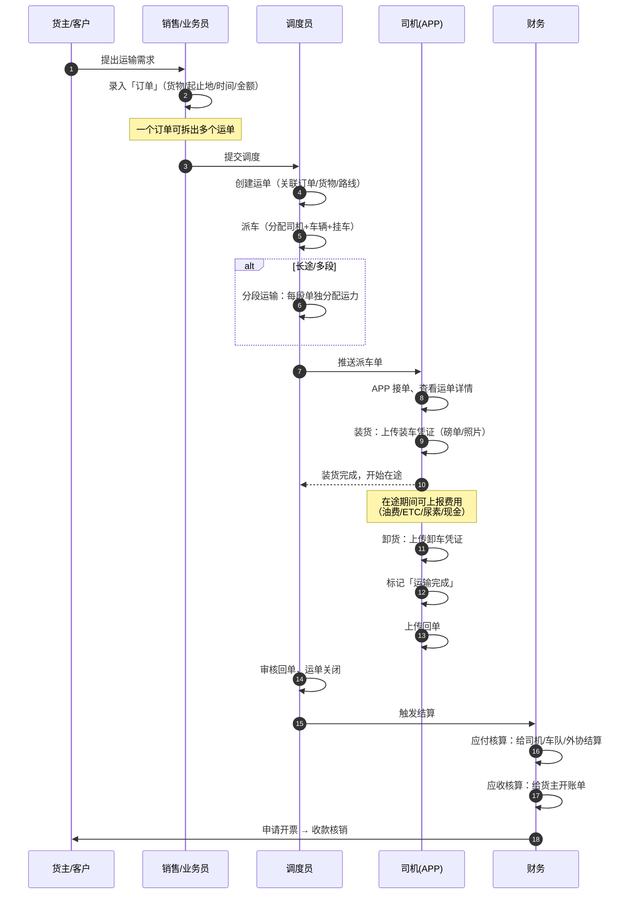
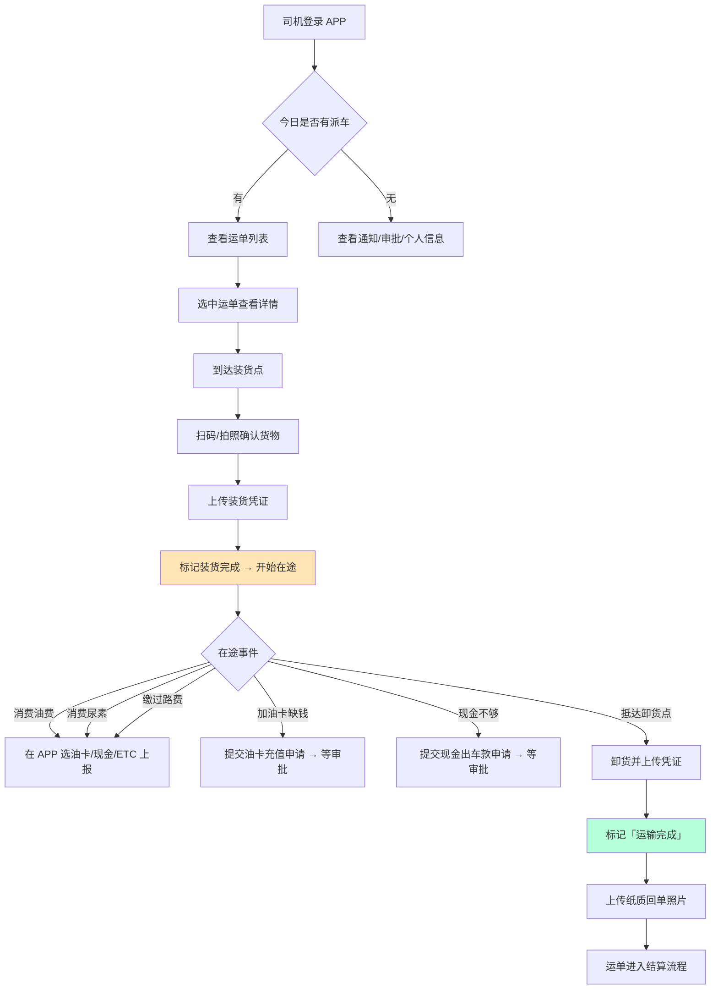
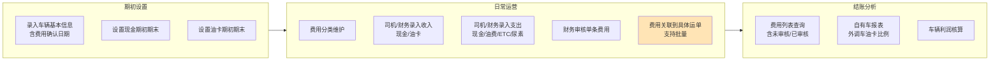
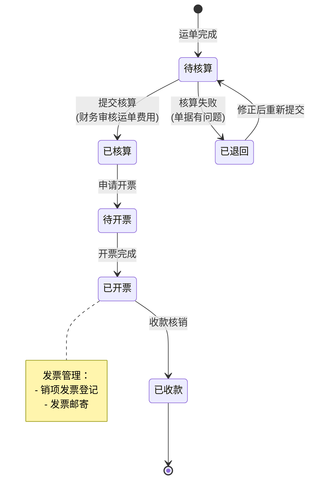
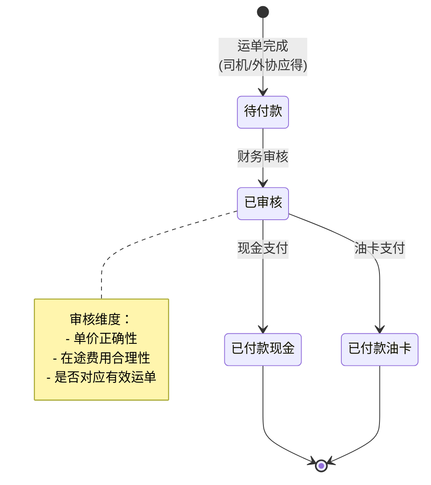
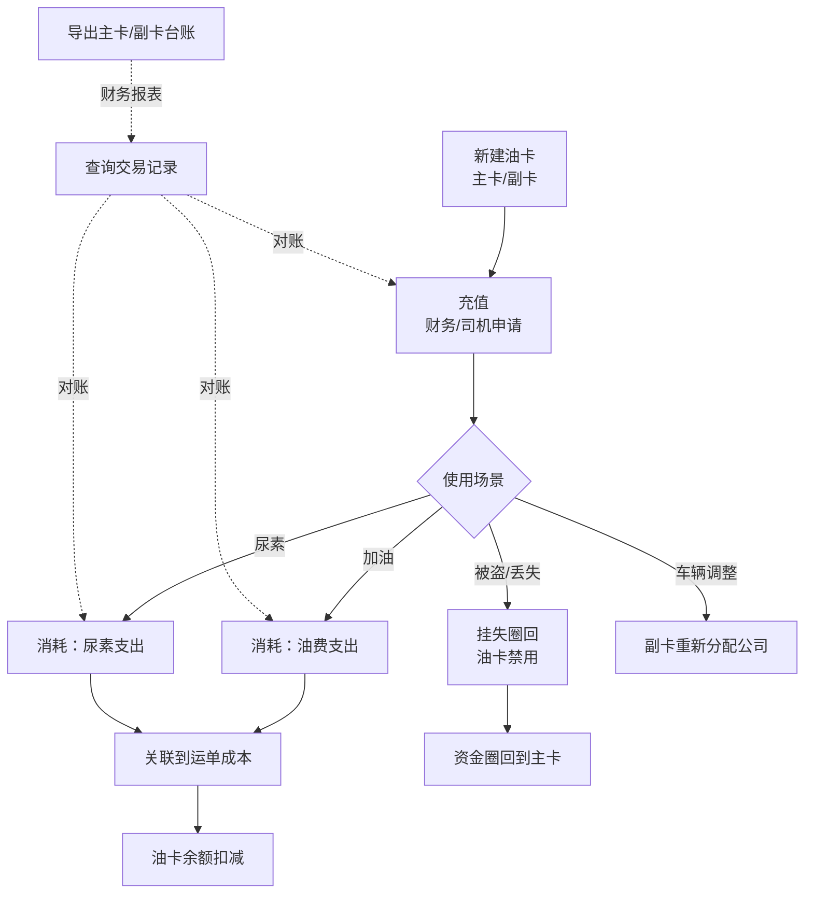
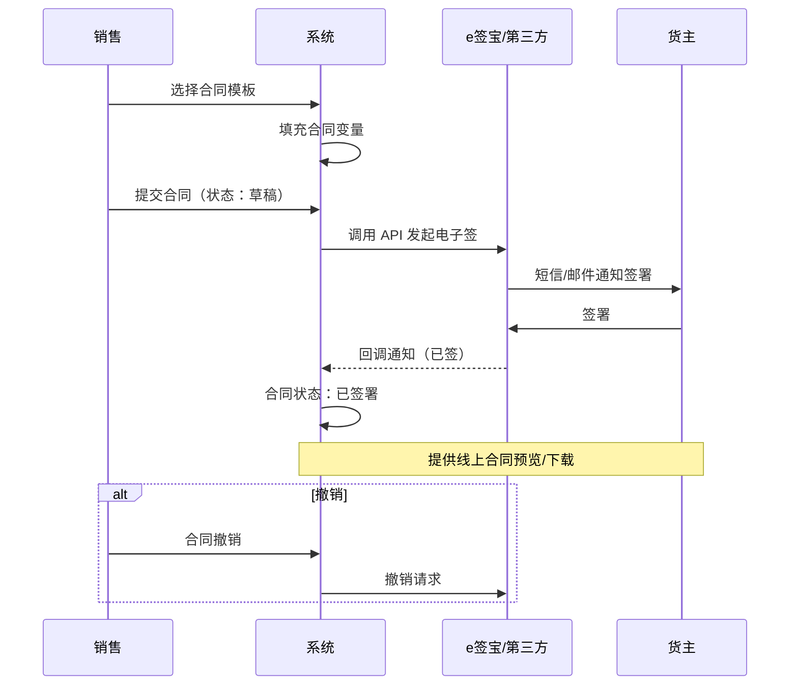
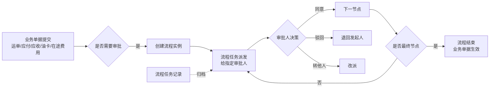
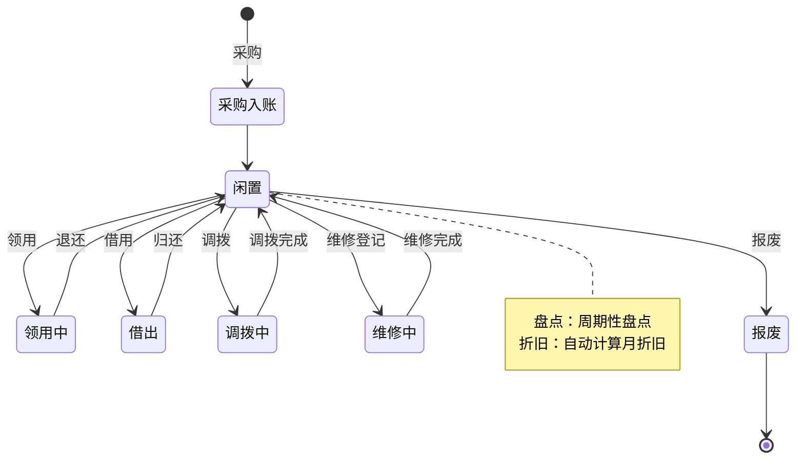

# SmartTMS 核心业务流程图（反向抽取）

> **目的**：理解一个成熟通用 TMS 是怎么把业务串起来跑的。  
> **方法**：从 Controller 接口和 API 操作名反推流程，描述"业务参与者做什么、按什么顺序"，**不描述代码调用**。  
> **可重用度**：流程的"结构骨架"可以参考，但每一步的"业务规则"必须基于你朋友公司的真实情况重新设计。

---

## 流程 1 · 主营业务闭环：客户下单 → 完成交付（最核心）

**关键节点**（每个都是一个独立功能模块）：
- ① 订单录入　② 运单生成　③ 派车　④ 装货　⑤ 在途　⑥ 卸货　⑦ 完成　⑧ 应付结算　⑨ 应收开票

**给冷链项目的启发**：
- 在 ④/⑤/⑥ 之间，**冷链需要插入"温度采集+报警"全程贯穿**
- 在 ④ 之前，**冷链需要"预冷确认"作为派车前置**
- 在 ⑦ 之后，**冷链需要"温度记录归档"用于合规留存**

---

## 流程 2 · 司机端 APP 作业流程

**给冷链项目的启发**：
- 司机 APP 是**冷链温控的关键执行点**：
  - 装货前必须让司机**确认预冷温度达标**才能开始
  - 装卸过程必须有"装卸窗口"标记，**避免被误判为超温**
  - 在途遇到**温度异常**司机必须能**一键响应**（确认/上报）

---

## 流程 3 · 自有车成本管理流程

**亮点**：SmartTMS 把**费用与运单挂钩**做得很精细，可以**算出每一单/每一辆车的真实成本**。冷链项目可以保留这套设计。

---

## 流程 4 · 应收账款流程

**给冷链项目的启发**：
- 这套"4 段式"状态机非常成熟，**可直接借鉴**
- 冷链业务可能要加 **"质量异议"** 状态：如果温度超标导致客户拒收/扣款，应收要走特殊流程

---

## 流程 5 · 应付账款流程（给司机/外协）

**给冷链项目的启发**：
- 外协司机/车队的应付逻辑通用，**直接参考**
- 冷链可加 **"温度合格扣款"**：超温导致货损，扣相应应付

---

## 流程 6 · 油卡管理流程（行业典型痛点）

**亮点**：SmartTMS 把油卡做得相当详细——**主副卡结构、挂失圈回、副卡分配公司**都覆盖了。这是物流行业最痛的财务漏洞点。

**给冷链项目的启发**：
- 油卡设计**可直接参考**
- 增加 **"冷藏机组用油"** 单独类目（冷链车的发动机油 vs 冷藏机组油是分开计的）

---

## 流程 7 · 合同 + 电子签流程

**给冷链项目的启发**：
- 电子签是 MVP 后置功能，**V2 再做**
- 冷链如涉及**药品 GSP**，合同里必须有"温度异常责任条款"，模板要预留

---

## 流程 8 · 流程审批引擎（横切能力）

**给冷链项目的启发**：
- 这是**横切能力**，建议在 V1 阶段就引入一个轻量审批引擎（如 Flowable 或自研）
- 冷链特别需要审批的场景：**温度异常处理、货损索赔、合规留档**

---

## 流程 9 · 固定资产生命周期（非核心，了解即可）

**给冷链项目的启发**：
- 冷链项目 **MVP 不需要** 这个模块
- V2/V3 可考虑加入：**温度传感器、车载终端、冷库设备**等专项资产管理

---

## 横向对照：SmartTMS 设计的优秀做法 vs 待改进点

### ✅ 值得借鉴的设计
1. **运单是核心实体**：所有的费用、凭证、状态都挂在运单上
2. **费用与运单挂钩**：能精确算每单成本，是 TMS 的关键
3. **油卡主副卡结构**：解决了行业痛点
4. **应收/应付的 4 段式状态机**：成熟、稳定
5. **流程审批做成横切能力**：减少重复开发
6. **司机 APP 与管理后台双向联动**：司机上报数据直接进入财务核算流程

### ⚠️ 待改进或冷链项目应该避免的
1. **没有 IoT 抽象层**：所有数据都靠人工录入，不适合冷链
2. **报表偏静态**：没有大屏实时监控、没有预测分析
3. **流程引擎实现度未知**：可能比较简陋，冷链业务可能要更强的引擎
4. **没有租户/多公司隔离**：如果你朋友的公司未来要做 SaaS，要重新做
5. **权限模型偏简单**：菜单+数据范围，冷链的复杂层级（总部/分公司/站点）可能不够
6. **数据库没有读写分离/时序数据库设计**：百万级温度数据会拖垮 MySQL
