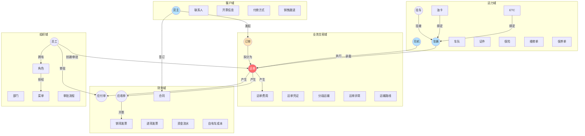
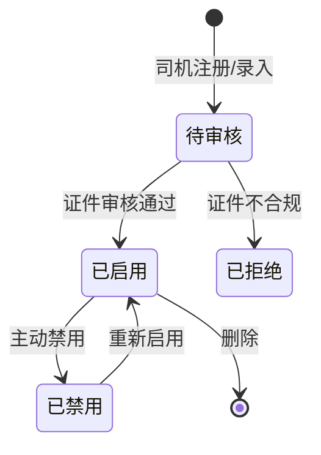
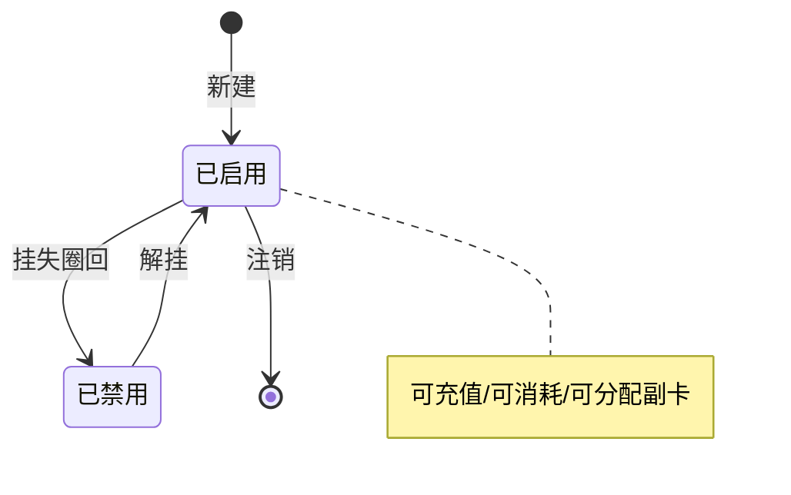
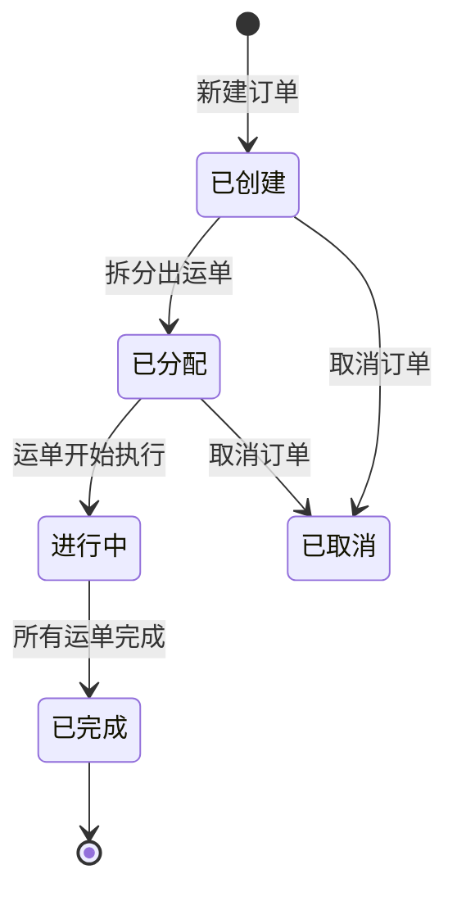
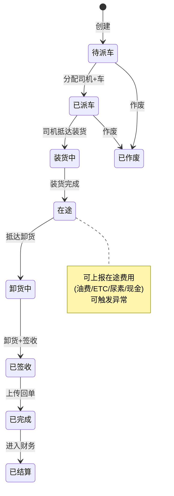
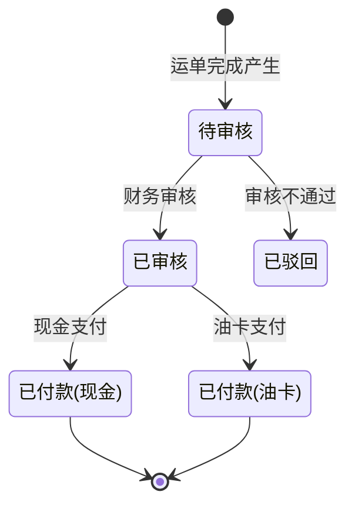
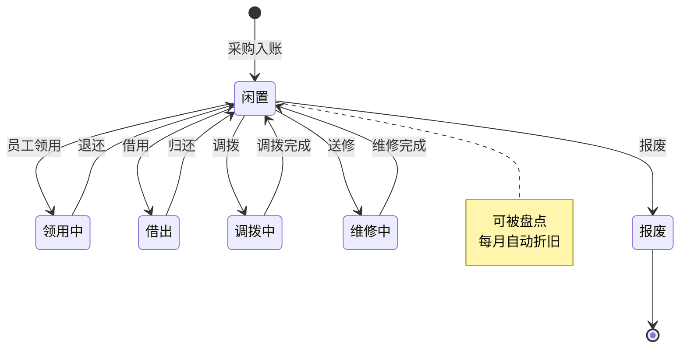

# SmartTMS 领域实体清单（反向抽取）

> **本文档性质**：从 SmartTMS 的领域包（domain/entity）和 Controller 接口反推出的**业务概念清单**，而非数据库表设计。  
> **关键原则**：
> - ✅ 描述"这个业务对象代表什么"
> - ✅ 描述"它有哪些状态、能做什么动作"
> - ✅ 描述"它和别的对象什么关系"
> - ❌ 不描述具体字段名、字段类型、数据库表名
> 
> 你后续做 PRD 和数据库设计时，应该**基于自己的业务**重新命名/裁剪/扩展，而不是照抄。

---

## 一、领域全景

**核心洞察**：
- **运单（Waybill）是绝对中心**——所有其他实体都直接或间接挂到运单上
- 业务域和财务域是 1:N 关系（一个运单产生多笔费用、多笔应付应收）
- 组织域是横切的（员工通过审批参与所有业务）

---

## 二、客户域

### 货主（Shipper）
- **含义**：发起运输需求的客户（B 端为主）
- **关键属性**（业务层面）：基本信息、业务负责人、客服负责人、状态、校验状态
- **关联**：1:N 联系人、1:N 开票信息、1:N 付款方式、1:N 邮寄地址、1:N 销售跟进、1:N 订单、1:N 合同
- **生命周期**：新建 → 启用 → （可禁用）→ 删除

### 联系人（ShipperContact）
- 货主的多个联系人之一，可标记默认

### 开票信息（ShipperInvoice）
- 一个货主可以有多套开票抬头

### 付款方式（ShipperPaymentWay）
- 月结 / 票结 / 即时 / 预付等

### 邮寄地址（ShipperMailAddress）
- 用于纸质票据邮寄

### 销售跟进（ShipperTrack）
- 销售活动记录

---

## 三、运力域

### 司机（Driver）
- **含义**：实际驾驶的人员
- **关键属性**：基本信息、经营模式（自有/外协/个体）、状态、银行账户、关联车辆
- **生命周期**：录入 → 证件审核 → 启用 → （可禁用/批量改状态）→ 删除

### 车辆（Vehicle）
- **含义**：货车主车
- **关键属性**：基本信息、经营模式、状态、关联挂车、绑定油卡/ETC、所属车队
- **生命周期**：与司机类似（待审核 → 启用 → 禁用 → 删除）

### 挂车（Bracket）
- **含义**：可与车辆挂接的拖挂部分
- **关键属性**：基本信息、经营模式、绑定车辆

### 车队（Fleet）
- **含义**：车辆的逻辑分组（按地区/品类/项目划分）

### 油卡（OilCard）
- **含义**：加油卡（主卡/副卡结构）
- **关键属性**：卡号、绑定车辆、余额、所属公司
- **生命周期**：

### ETC（Etc）
- 类似油卡，用于高速通行费

### 维修单 / 保养单 / 审车 / 保险
- 都是车辆的"事件"实体，记录某次维修/保养/年审/保险事项

### 到期证件
- 一个聚合查询视图：把所有需要到期提醒的证件汇总

---

## 四、业务交易域（核心）

### 订单（Order）
- **含义**：客户给的"运输需求"，可能拆成多个运单
- **关键属性**：货主、货物、起止地、要求时间、订单金额、状态
- **生命周期**：

### 运单（Waybill）⭐ **核心实体**
- **含义**：一段具体的运输任务，绑定唯一的"司机+车+起止"
- **关键属性**：关联订单、货主、司机、车辆、挂车、路线、运输费用、凭证、状态
- **关联**：1:N 货物、1:N 费用、1:N 凭证、1:N 异常、1:N 分段、1:N 应付、1:N 应收
- **生命周期**：

### 运单货物（WaybillGoods）
- 一个运单可载多种货物

### 运单费用（WaybillCost）
- 一个运单的所有费用条目（运费、装卸、过路、油费等）

### 运单凭证（WaybillVoucher）
- 装卸照片、磅单、回单、派车单

### 分段运输（WaybillSplitTransport）
- 一票多段时，每段单独的运力分配

### 运单异常（WaybillException）
- 运输中发生的异常事件（事故、延误、货损等）

### 应收费用（WaybillReceiveCost）
- 运单的应收明细（向货主收钱）

### 油卡充值申请（WaybillOilCardRechargeApply）
- 司机在途发起的充值申请

### 运输路线（Route）
- 路线模板，可被运单引用

---

## 五、财务域

### 应付单（PayOrder）
- **含义**：要付给司机/外协/供应商的钱
- **状态机**：

### 应收单（ReceiveOrder）
- **含义**：要向货主收的钱
- **状态机**（见 02-业务流程图.md 流程 4）

### 销项发票（ReceiveOrderInvoice）
- 应收对应的发票

### 进项发票（OA-Invoice）
- 公司收到的发票（油卡/过路费/采购）

### 合同（Contract）
- **含义**：与货主或司机签订的服务合同
- **关键属性**：合同模板类型、签署方、状态、电子签信息
- **关联**：1:1 e签宝签署记录

### 资金流水（CapitalFlow）
- 银行/现金的所有进出记录

### 自有车成本（CarCost*）
- 一组实体：基本信息、期初期末、收入（现金/油卡）、支出（现金/油费/ETC/尿素）、费用列表、费用分类
- **核心设计**：每条费用可以关联到具体运单，从而精确核算单运单成本

---

## 六、固定资产域

### 资产（Asset）
- **生命周期**：

### 易耗品（Consumables）
- 类似资产，但走的是"入库 → 领用 → 消耗"的流程

---

## 七、组织域

### 员工（Employee）
- 含义：内部用户
- 状态：启用/禁用
- 关联：N:N 角色、1:1 部门、1:1 直接上级

### 部门（Department）
- 树形结构

### 角色（Role）
- N:N 员工
- N:N 菜单（决定能看什么页面）
- N:N 数据范围（决定能看哪些数据：全公司/部门/本人）

### 菜单（Menu）
- 树形结构，对应 UI 路由 + 权限点

### 数据范围（DataScope）
- 系统级配置：决定"角色能看到的数据范围"

### 审批流程（Flow / FlowInstance / FlowInstanceTask）
- **3 层结构**：
  - Flow：流程定义（流程模板）
  - FlowInstance：流程实例（一次审批）
  - FlowInstanceTask：节点任务（具体某人要审的事）

---

## 八、支撑域（系统级）

### 文件（File）
- 通用文件存储，被各业务引用

### 字典（DictKey + DictValue）
- 业务字典（如：经营模式、车辆类型）

### 帮助文档（HelpDoc + HelpDocCatalog）
- 用户帮助

### 钉钉事件记录（DingDingEventRecord）
- 钉钉集成的回调存档

### 代码生成器配置（CodeGeneratorConfig）
- 内部开发工具的配置

### 更新日志（ChangeLog）

---

## 九、给冷链项目的领域建模启发

### ✅ 可直接借鉴的领域设计
1. **货主 / 司机 / 车辆 / 挂车四大主数据**——业务通用，命名稍调即可
2. **订单 → 运单**的拆分关系——通用模式，可保留
3. **运单的费用 / 凭证 / 异常 / 分段**子实体设计——成熟，可保留
4. **应付/应收的状态机**——成熟，可保留
5. **油卡的主副卡 + 状态机**——保留
6. **员工/角色/菜单/数据范围的 RBAC**——保留，但要增强

### ⚠️ 必须新增的冷链领域实体

| 新增实体 | 含义 | 关联 |
|---|---|---|
| **温度记录（TempRecord）** | 时序数据，每分钟/每段时间一条 | N:1 运单、N:1 车辆 |
| **温度阈值（TempThreshold）** | 配置：每种货物/温区允许的温度范围 | 1:N 货物类型 |
| **温度报警（TempAlarm）** | 触发报警时的快照 | N:1 运单 |
| **温区（TempZone）** | 温度分区配置 | N:N 车辆 / 1:N 仓库 |
| **预冷记录（PreCoolRecord）** | 车辆/仓库预冷过程 | N:1 车辆 |
| **车载终端（OBU/IoTDevice）** | IoT 设备档案 | 1:1 车辆 |
| **追溯链路（TraceabilityChain）** | 整票货从仓→车→客的全程留痕 | 1:1 运单 |
| **冷库（ColdStorage）** | 冷库基本信息 + 温区 | 1:N 库位 |
| **库位（StorageLocation）** | 冷库内的具体储位 | N:1 冷库 |
| **入库单 / 出库单** | WMS 基础单据 | N:1 冷库 |
| **政府对接配置（GovIntegration）** | 部标 808 / 药监等对接信息 | 横切 |
| **合规留档（ComplianceArchive）** | 不可篡改的温度档案（5年留存） | 1:1 运单 |

### ⚠️ 必须改造的现有实体

| 实体 | 改造点 |
|---|---|
| **运单（Waybill）** | 加 `温度要求`、`温区类型`、`允许超温秒数`、`关联温度记录id列表` |
| **车辆（Vehicle）** | 加 `制冷机型号`、`传感器列表`、`是否多温区`、`部标终端 SN` |
| **司机（Driver）** | 加 `冷链培训证书`、`GSP 资格`（如医药冷链） |
| **货物（Goods）** | 加 `温度区间`、`允许超温阈值`、`合规等级（GSP/食品/普货）` |
| **货主（Shipper）** | 加 `合规要求等级`、`是否要求溯源` |

### ⚠️ 完全不要的实体（冷链 MVP 不需要）
- 固定资产管理（资产/折旧/盘点等）→ V2 再考虑
- 易耗品管理 → V3 再考虑
- 部分 OA 功能（费用申请等）→ 用现成 OA 系统对接即可

---

## 十、领域建模的关键决策建议

> 你后续做 PRD 和数据库设计时，建议遵循以下原则：

1. **运单（Waybill）依然是核心**——但**冷链运单**要包含温度要求和温度记录的关联
2. **温度记录单独建库**——用 TimescaleDB 或 TDengine 等时序数据库，**不要塞 MySQL 主库**
3. **IoT 设备抽象成"数据源"**——不绑定具体硬件型号，支持后期换硬件
4. **追溯链路要不可篡改**——可考虑哈希链 + 定期上链（区块链可选）
5. **温区是配置而非硬编码**——每个温区允许范围可配置（生鲜 vs 医药 vs 疫苗）
6. **报警阈值与触发逻辑分离**——配置数据 vs 实时计算引擎分开设计
