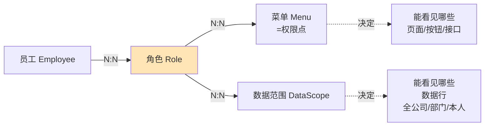
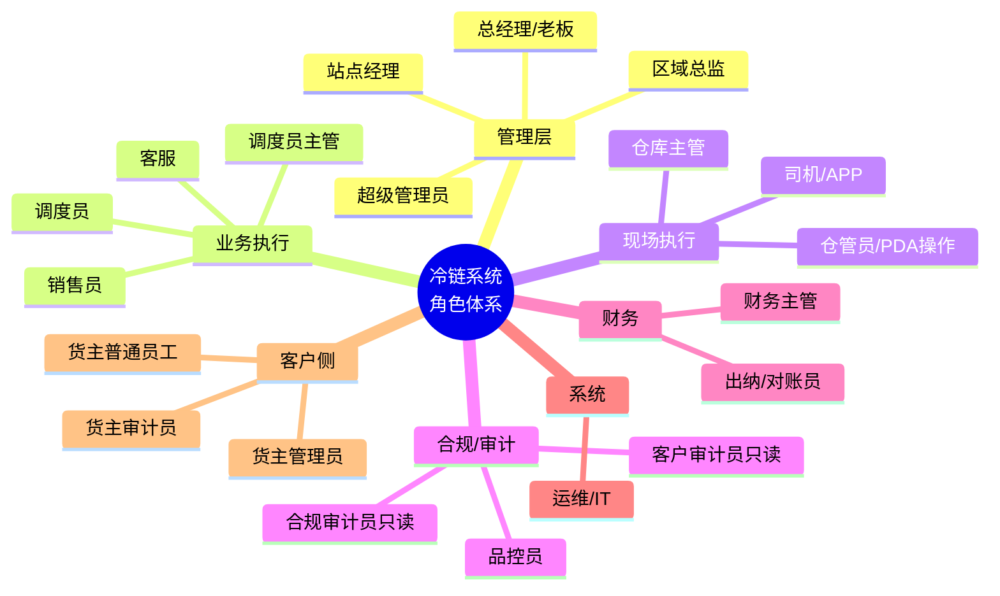

# SmartTMS 角色权限矩阵（反向抽取）

> **本文档性质**：从 SmartTMS 的菜单结构、模块归类、移动端能力等反推出的**角色—功能矩阵**，作为冷链项目角色权限设计的参考。  
> **重要提示**：SmartTMS 内置的角色机制非常灵活（菜单+数据范围动态绑定），下面列出的是**业务上常见的角色配置**，并非系统强制划分。

---

## 一、识别出的角色（4 大类 + 8 个细分）

| 角色类型 | 角色细分 | 工作场景 |
|---|---|---|
| **管理层** | 超级管理员 | 系统全局配置、权限管理、不参与业务 |
| **管理层** | 业务老板 / 部门主管 | 看大盘报表、审批关键决策 |
| **业务岗** | 销售员 / 业务员 | 维护货主、接单、跟进 |
| **业务岗** | 调度员 | 派车、运单管理、监控在途 |
| **业务岗** | 客服 | 处理货主咨询、跟单 |
| **执行岗** | 司机 (移动端) | 接单、装卸、上报费用 |
| **职能岗** | 财务 | 应付应收、对账、开票、油卡 |
| **职能岗** | 仓管 (隐含) | 仓库出入库（SmartTMS 弱实现） |

---

## 二、详细权限矩阵

> 图例：✅ 全部 / 🟡 部分 / 👀 仅查看 / ❌ 无

| 功能模块 \ 角色 | 超管 | 主管 | 销售 | 调度 | 客服 | 司机 | 财务 |
|---|---|---|---|---|---|---|---|
| **A. 客户管理** | | | | | | | |
| 货主 CRUD | ✅ | ✅ | ✅ | 👀 | 👀 | ❌ | 👀 |
| 货主开票/付款 | ✅ | ✅ | ✅ | ❌ | ❌ | ❌ | ✅ |
| 货主跟进 | ✅ | ✅ | ✅ | ❌ | ✅ | ❌ | ❌ |
| **B. 运力管理** | | | | | | | |
| 司机 CRUD | ✅ | ✅ | ❌ | ✅ | 👀 | 👀本人 | 👀 |
| 车辆 CRUD | ✅ | ✅ | ❌ | ✅ | 👀 | 👀关联 | 👀 |
| 挂车 CRUD | ✅ | ✅ | ❌ | ✅ | 👀 | 👀关联 | 👀 |
| 维修/保养/审车/保险 | ✅ | ✅ | ❌ | 🟡 | ❌ | ❌ | 👀 |
| 到期证件 | ✅ | ✅ | ❌ | ✅ | ❌ | ❌ | 👀 |
| **C. 业务交易** | | | | | | | |
| 订单 CRUD | ✅ | ✅ | ✅ | ✅ | 🟡 | ❌ | 👀 |
| 运单 CRUD | ✅ | ✅ | 👀 | ✅ | 🟡 | 👀关联 | 👀 |
| 派车（分配司机/车） | ✅ | 🟡 | ❌ | ✅ | ❌ | ❌ | ❌ |
| 装卸操作 | ❌ | ❌ | ❌ | ❌ | ❌ | ✅ | ❌ |
| 凭证上传 | ✅ | 👀 | 👀 | 🟡 | 🟡 | ✅ | 👀 |
| 运单异常处理 | ✅ | ✅ | 👀 | ✅ | 🟡 | 🟡 | 👀 |
| **D. 财务结算** | | | | | | | |
| 应付管理 | ✅ | 👀 | ❌ | ❌ | ❌ | ❌ | ✅ |
| 应收管理 | ✅ | 👀 | 👀 | ❌ | ❌ | ❌ | ✅ |
| 合同/电子签 | ✅ | ✅ | ✅ | ❌ | ❌ | ❌ | ✅ |
| 油卡管理 | ✅ | 👀 | ❌ | 👀 | ❌ | 👀 | ✅ |
| 油卡充值审批 | ✅ | ✅ | ❌ | 🟡 | ❌ | 申请 | ✅ |
| 自有车成本 | ✅ | 👀 | ❌ | 🟡 | ❌ | 录入 | ✅ |
| 资金流水 | ✅ | 👀 | ❌ | ❌ | ❌ | ❌ | ✅ |
| **E. 报表分析** | | | | | | | |
| 首页统计 | ✅ | ✅ | 🟡 | 🟡 | 🟡 | 🟡 | 🟡 |
| 货主报表 | ✅ | ✅ | ✅(本人) | 👀 | ✅(本人) | ❌ | ✅ |
| 运单报表 | ✅ | ✅ | 🟡 | ✅ | 🟡 | ❌ | ✅ |
| 财务报表 | ✅ | ✅ | ❌ | ❌ | ❌ | ❌ | ✅ |
| 员工报表 | ✅ | ✅ | ✅(本人) | ✅(本人) | ✅(本人) | ❌ | ✅ |
| **F. 固定资产** | | | | | | | |
| 资产/易耗品 | ✅ | ✅ | ❌ | 🟡 | ❌ | ❌ | ✅ |
| **G. 系统与组织** | | | | | | | |
| 员工/部门/角色/菜单 | ✅ | ❌ | ❌ | ❌ | ❌ | ❌ | ❌ |
| 流程审批配置 | ✅ | 🟡 | ❌ | ❌ | ❌ | ❌ | ❌ |
| 系统日志 | ✅ | ❌ | ❌ | ❌ | ❌ | ❌ | ❌ |
| **H. OA** | | | | | | | |
| 通知公告 | ✅ | ✅ | 👀 | 👀 | 👀 | 👀 | 👀 |
| 意见反馈 | ✅ | ✅ | ✅ | ✅ | ✅ | ✅ | ✅ |
| 企业信息/银行/发票 | ✅ | 👀 | ❌ | ❌ | ❌ | ❌ | ✅ |
| **I. 移动端** | | | | | | | |
| 司机端 APP 登录 | ❌ | ❌ | ❌ | ❌ | ❌ | ✅ | ❌ |
| 员工端 H5 | ✅ | ✅ | ✅ | ✅ | ✅ | ❌ | ✅ |

---

## 三、权限实现机制（SmartTMS 的做法）

SmartTMS 的权限系统由以下 4 层组成：

**4 层结构**：
1. **员工** ↔ **角色**：一个员工可有多角色
2. **角色** ↔ **菜单**：角色决定能访问什么页面/接口
3. **角色** ↔ **数据范围**：决定能看到什么范围的数据
4. **菜单** ↔ **请求路径**：菜单背后对应到具体后端 API 路径

**数据范围的典型配置**：
- **全公司**：能看到所有数据
- **本部门**：只能看到本部门员工创建的数据
- **本部门及下级**：能看到树形下属部门
- **仅本人**：只能看到自己创建/经手的数据

---

## 四、给冷链项目的权限设计建议

### ✅ 可借鉴的做法
1. **「角色 + 菜单 + 数据范围」三件套**：成熟的 RBAC 实现，冷链可继续用
2. **菜单 → 权限点**的映射：粒度足够细
3. **数据范围解耦**：把"能看见什么"和"能操作什么"分开

### ⚠️ 冷链项目需要增强的点

| 增强点 | 原因 |
|---|---|
| **支持多层级数据隔离**（总部/分公司/站点） | 朋友公司可能是多级架构，SmartTMS 是扁平 RBAC |
| **新增「司机自有数据」隔离** | 司机只能看到自己运单的温度数据 |
| **新增「客户自助查询」角色** | 货主能自助查自己的温度记录（不是 SmartTMS 设计的） |
| **新增「合规审计员」只读角色** | GSP 监管/客户审计时使用 |
| **温度数据的特殊权限** | 温度数据是合规留档，**修改权限要严格控制+审计日志** |
| **多租户隔离**（V2 才考虑） | 如果未来 SaaS 化，必须从 V1 就预留多租户字段 |
| **动态字段级权限** | 例如：客服可以看运单但不能看金额；冷链可能要"司机能看温度但不能改阈值" |

### 推荐的冷链项目角色清单

**关键差异**（vs SmartTMS）：
- 多了 **「品控员」「合规审计员」**——冷链行业特色
- 多了 **「客户侧角色」**（货主能自助操作的角色）
- 多了 **「区域/站点」层级**——支持多层组织
- 多了 **「PDA 操作员」**——仓库出入库专用
