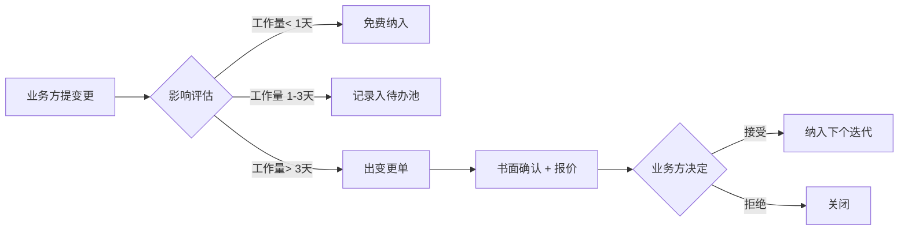

# 关键风险与假设登记表

> **目的**：在需求未完全确认前，把"我们正在赌的事"全部显式记录，避免开发完才发现是错的。  
> **使用**：每个假设访谈后验证，要么"确认为事实"，要么"调整为正确假设"。  
> **风险等级**：🔴 高 / 🟡 中 / 🟢 低

---

## 一、当前已识别的关键假设（待验证）

| # | 假设内容 | 风险等级 | 影响范围 | 验证方式 | 状态 |
|---|---|---|---|---|---|
| AS-01 | 项目目标是承运方角度的 TMS+WMS 系统（不是平台型撮合） | 🔴 | 整个系统视角 | A1 反问 | 待验证 |
| AS-02 | 主营品类是食品/生鲜冷链，不涉及医药/疫苗（无需 GSP） | 🔴 | 合规级别、温度精度、追溯深度 | A3 + G1 反问 | 待验证 |
| AS-03 | 不需要对接政府监管平台（部标 808 / 药监系统） | 🔴 | 硬件协议、上线流程 | E4 反问 | 待验证 |
| AS-04 | 车辆数 < 200 辆，月单量 < 1 万单（中小规模） | 🟡 | 架构选型（是否分布式） | A2 反问 | 待验证 |
| AS-05 | 部署在公有云（阿里云/腾讯云），不要求私有化 | 🟡 | 基础设施成本、部署方案 | F5 反问 | 待验证 |
| AS-06 | 后端使用 Java Spring Boot（已确认） | 🟢 | 技术栈 | 已确认 | ✅ 已定 |
| AS-07 | MVP 上线周期 6-8 周可接受 | 🟡 | 项目计划 | H2 反问 | 待验证 |
| AS-08 | 司机平均年龄 35-50 岁，能用智能手机但偏好简单大字界面 | 🟡 | 司机 APP 设计 | B3 反问 | 待验证 |
| AS-09 | 温度采集间隔 5 分钟可接受（非药品冷链） | 🟡 | IoT 数据量、报警延迟 | D2 反问 | 待验证 |
| AS-10 | 调度模式为"系统推荐 + 人工确认"（不是全自动撮合） | 🟡 | 调度算法复杂度 | C4 反问 | 待验证 |
| AS-11 | 计价模型不超过 3-5 种规则 | 🟡 | 计费引擎复杂度 | C3 反问 | 待验证 |
| AS-12 | 不需要对接 ERP（金蝶/用友/SAP） | 🟡 | 集成工作量 | E6 反问 | 待验证 |
| AS-13 | 等保只要求基础（不强制过等保 2.0 三级） | 🟡 | 安全改造工作量 | F4 反问 | 待验证 |
| AS-14 | 客户端（货主端 APP/小程序）非 MVP 范围 | 🟢 | 工作量、上线节奏 | B5 反问 | 待验证 |
| AS-15 | 老系统迁移数据量不大或无需迁移 | 🟡 | 数据迁移工作量 | A6 反问 | 待验证 |

---

## 二、当前已识别的关键风险（含应对预案）

| # | 风险描述 | 等级 | 触发概率 | 影响 | 应对预案 |
|---|---|---|---|---|---|
| R-01 | 朋友自己也不熟业务，需求反复变更 | 🔴 | 高 | 周期翻倍、回款慢 | 严格走需求确认签字流程；按里程碑分批确认；变更走变更单 |
| R-02 | 业务方临时提出对接政府监管平台（部标 808） | 🔴 | 中 | 重做接入层 | 反问 E4 + 合同写明范围；超出范围按变更收费 |
| R-03 | 车载硬件没选定/品牌混乱、协议各异 | 🔴 | 高 | IoT 接入层反复改 | 提前敲定硬件标准；用适配器模式做 IoT 网关 |
| R-04 | 司机 APP 易用性不够，老司机拒用 | 🟡 | 中 | 上线后投诉 | 早期做 1-2 轮真实司机访谈+原型验证 |
| R-05 | 温度数据量爆炸（百万级/天）拖垮数据库 | 🟡 | 中 | 性能问题 | 时序数据用 TDengine 或分库分表；冷数据归档 |
| R-06 | 第三方依赖（地图/短信/电子签）账号未到位 | 🟡 | 高 | 联调延期 | 项目启动第一周就采购+申请 |
| R-07 | 合规要求后置（上线后才被监管要求） | 🔴 | 中 | 整改大返工 | G1 反问尽早确认；架构预留合规扩展点 |
| R-08 | 朋友不付尾款 / 项目周期回款慢 | 🔴 | 中 | 现金流断裂 | 合同分阶段付款；首付≥30%；MVP 上线收 60%；尾款 1 个月内 |
| R-09 | 外包给团队/个人，质量不可控 | 🟡 | 高 | 质量返工 | 提前定 Cursor Rules + Code Review 流程 + 自动化测试 |
| R-10 | 我（你）一人扛产品+技术+PM，超出带宽 | 🟡 | 高 | 自身压力大、延期 | 用 Cursor + AI 提效；非核心模块外包；学会拒绝过度需求 |

---

## 三、关键决策点（需要业务方拍板）

| # | 决策点 | 选项 | 截止时间 | 决策人 |
|---|---|---|---|---|
| D-01 | 是否覆盖医药冷链（决定合规级别） | A 只做食品 / B 含医药 | 第 1 次访谈 | 朋友 |
| D-02 | 是否对接政府监管平台 | A 不接 / B 部标808 / C 药监 | 第 1 次访谈 | 朋友 |
| D-03 | 车载终端方案 | A 已有 / B 我们推荐采购 / C 自研 | 第 2 次访谈 | 朋友 + 我们 |
| D-04 | 部署方式 | A 公有云 / B 私有化 / C 混合 | 第 2 次访谈 | 朋友 |
| D-05 | MVP 范围（5 个核心功能） | 见 C1 | 第 2 次访谈 | 朋友 + 我们 |
| D-06 | 客户端是否在范围内 | A 不做 / B 小程序 / C 全套 | 第 2 次访谈 | 朋友 |
| D-07 | 移动端技术栈 | A uni-app / B Flutter / C 原生 | 由我们提案 | 我们 |
| D-08 | 数据库选型（时序数据） | A PG+TimescaleDB / B TDengine / C InfluxDB | 由我们提案 | 我们 |

---

## 四、变更管理流程（建议写进合同）

