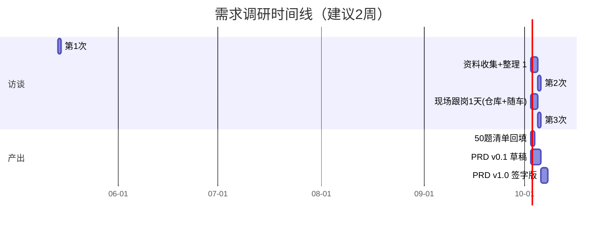

# 调研访谈安排建议

> **目的**：让你在最短的时间（≈ 5-6 小时访谈 + 3-5 天观察）把朋友公司的真实业务摸清楚。  
> **核心理念**：不要相信朋友"口头描述"，一定要去现场看、看老 Excel、看老系统、看微信群聊。

---

## 一、访谈节奏建议（3 次，跨 1-2 周）



---

## 二、每场访谈的目标和参与者

### 🎯 第 1 次访谈：发起人访谈（朋友本人）⏱ 2 小时

**目标**：搞清楚"为什么要做"、商业目标、预算、决策权。

**参与者**：朋友（决策人）+ 你

**核心议题**：
1. 公司当前最大的痛点是什么？（让他用 3 句话讲）
2. 这个系统上线后，他最希望发生什么改变？（量化指标）
3. 谁是这个项目的真正使用者？（不一定是他）
4. 预算和周期的硬约束
5. 第 2 次访谈安排（让他指定 2-3 个真正懂业务的骨干）

**问题来源**：A1、A2、A6、A7、H1、H2 + 项目目标

**输出**：
- 项目核心目标 1 句话
- 业务方决策人 / 关键干系人名单
- 第 2 次访谈安排

**避坑提醒**：
- ❌ 别问"你想要什么功能"——他会列一堆做不完
- ✅ 要问"哪个问题最痛、最近一个月最大的损失是什么"

---

### 🎯 第 2 次访谈：业务骨干访谈 ⏱ 3 小时

**目标**：拿到 50 个反问清单的具体答案。

**参与者**：
- 必到：调度员主管 / 仓库主管 / 财务对账员 / 1-2 名资深司机
- 可选：朋友本人列席

**核心议题**（按角色分轮）：

| 时段 | 时长 | 谁 | 谈什么 | 对应反问 |
|---|---|---|---|---|
| 0:00-0:30 | 30min | 调度员主管 | 现在每天怎么派车？拿什么排车？拿什么和司机沟通？ | C4、D5、D6 |
| 0:30-1:00 | 30min | 调度员主管 | 报警/异常处理 | D3、D4、D8、D10 |
| 1:00-1:40 | 40min | 仓库主管 | 出入库流程、扫码方式、温区分区 | D1、D7、E7、C7 |
| 1:40-2:10 | 30min | 财务 | 计价规则、对账、开票流程 | C3、C6 |
| 2:10-2:40 | 30min | 司机 | 现在收单怎么收、装卸怎么操作、报警怎么响应 | B3、C5、D4 |
| 2:40-3:00 | 20min | 朋友 | 收尾、补足细节 | 待办 |

**访谈技巧**：
- **5 Why 法**：每个流程问 5 个为什么，挖到本质
- **现场示范法**：让他打开当前的 Excel/老系统给你看，看比说有效 10 倍
- **场景反演法**：问"上个月最离谱的一单是怎么处理的？"——能挖出系统死角
- **录音 + 屏幕共享**：访谈结束 2 小时内整理

---

### 🎯 中间环节：现场跟岗 1 天（极其重要！）

> 这是大部分外包项目漏掉的环节，导致后续 80% 的需求变更。

**安排**：
- **上午 4 小时**：仓库跟岗——看出入库实际怎么做，扫码顺手不顺手，温区怎么标识
- **下午 4 小时**：随车跟车——跟一辆司机跑一趟，看装货 / 在途 / 卸货 / 签收的全过程

**重点观察**：
- 司机用手机/对讲机/纸单/扫码枪的真实场景
- 异常情况怎么处理（堵车、温度突变、客户拒收）
- 调度员怎么"救火"
- 老 Excel 怎么填、和谁对接、用了多少年

**输出**：
- 拍 30-50 张现场照片，建一份《现场观察笔记》放到 `assets/现场调研/`
- 每个角色画一个"用户旅程图"

---

### 🎯 第 3 次访谈：闭环确认 ⏱ 1.5 小时

**目标**：把 50 个反问的答案、风险、关键决策点逐项过一遍，**纸面签字确认**。

**参与者**：朋友 + 关键决策人 + 你

**议程**：
1. (30min) 业务方答复记录逐项 review
2. (20min) 关键风险逐项确认（特别是 R-01 ~ R-08）
3. (20min) 决策点 D-01 ~ D-08 全部拍板
4. (20min) MVP 范围最终敲定（写黑板上签字）

**输出**：
- 《需求确认书 v1.0》—— 双方签字，作为合同附件

---

## 三、访谈高效的 12 条军规

| # | 军规 | 解释 |
|---|---|---|
| 1 | 永远问"为什么"，不问"要不要" | 避免被引导出无用功能 |
| 2 | 永远要"看老资料"，不只听口述 | 老 Excel/微信群截图/老系统截图比口述准确 |
| 3 | 永远找一线员工，不只听老板说 | 老板说的常常是他"以为的"流程 |
| 4 | 永远做录音+笔记，24h 内整理 | 记忆衰减极快 |
| 5 | 永远问"上个月最差/最难的一单" | 异常场景才是真需求 |
| 6 | 永远问数字、不要"差不多" | "差不多 100 辆车" vs "187 辆"差异巨大 |
| 7 | 永远问"现在没有这个系统怎么过的" | 现存解决方案就是 MVP 的标杆 |
| 8 | 永远问"如果这个功能没有会怎样" | 区分必须 vs 想要 |
| 9 | 永远问到边界条件 | "如果客户不在怎么办" "如果断网怎么办" |
| 10 | 永远问"谁说了算" | 找到真正的决策人 |
| 11 | 永远拒绝"业务方教你怎么做技术" | 礼貌打断："这个我们设计阶段考虑，您给我们说目标就好" |
| 12 | 永远在每次访谈结束前给 next step | "下周一前我把 PRD 草稿发您，您 3 天内 review" |

---

## 四、访谈前给朋友的"预热消息"模板

> 直接复制粘贴发微信给朋友

```
老张，下周我们启动冷链系统的需求调研。为了让访谈高效（你时间宝贵），
麻烦你提前做 3 件事：

1️⃣ 把你想到的功能、痛点先随手列一个清单（不用排版，记事本就行）
2️⃣ 找出公司目前在用的 Excel/系统截图，能发我的发我
3️⃣ 帮我约一下：调度员主管、仓库主管、财务对账员、1-2 个老司机，
   下周二下午能集中 3 小时一起聊聊

第一次只跟你聊 2 小时，主要确认目标和预算；第二次约骨干聊业务；
中间我跟一天班看实际操作；最后一次咱们把需求确认书签字。

整个调研期 1-2 周，之后 1 周出 PRD 文档。这是常规外包项目的最快节奏，
跳过任何一步上线后都要返工。

我下周一上午 10 点登门，可以吗？
```

---

## 五、给你的「访谈包」清单

访谈那天带的东西：

- [ ] 笔记本电脑（投屏访谈用 + 录音）
- [ ] 录音笔 / 手机录音（双备份）
- [ ] 打印好的《50 个关键反问清单》3 份
- [ ] 打印好的《业务方答复记录-模板》3 份
- [ ] A3 白纸 + 马克笔（画流程图用）
- [ ] 名片
- [ ] 充电宝
- [ ] 跟车那天：保暖衣服（冷藏车很冷）+ 防滑鞋

---

## 六、访谈后产出物

每次访谈后必须产出（24 小时内）：

| 产出 | 路径 | 用途 |
|---|---|---|
| 访谈纪要 | `docs/00-需求澄清/访谈纪要-YYYYMMDD.md` | 留底 |
| 答复记录回填 | `docs/00-需求澄清/业务方答复记录.md`（不带"模板"字样的版本） | 喂给 AI 生成 PRD |
| 风险登记表更新 | `docs/00-需求澄清/关键风险与假设登记表.md` | 持续维护 |
| 现场照片/截图 | `assets/现场调研/` | 设计参考 |

