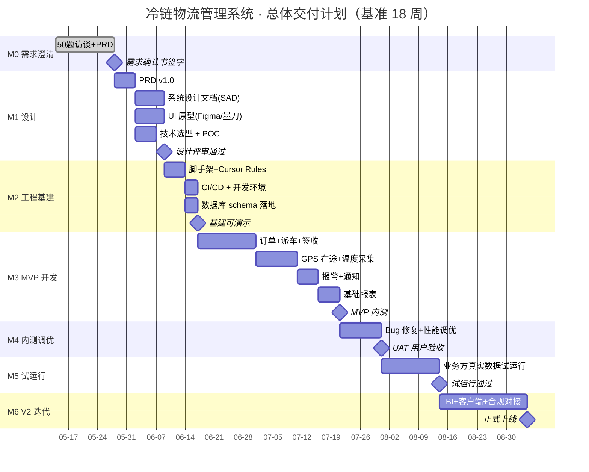

# 项目里程碑与交付计划

> **角色背景**：你一人扛 **产品 + 技术 + 项目管理 + 部分开发**，外包给第三方/兼职团队。  
> **核心策略**：用 Cursor + AI 提升 3-5 倍效率，让单人能完成 3-5 人团队的项目管理 + 产品 + 架构工作。  
> **本文档作用**：把整个项目切成 7 个里程碑，每个里程碑都有"明确的交付物 + 时长 + 验收标准 + 付款节点"。

---

## 一、总体路线图

**总周期**：约 **18 周（≈ 4.5 个月）** 到 MVP 上线，**24 周**到 V2 上线。

---

## 二、7 个里程碑详解

### M0 · 需求澄清 ⏱ 2 周
**目标**：从"业务愿景"变成"可签字的需求确认书"。

| 项目 | 内容 |
|---|---|
| **关键交付物** | 50题反问清单（已完成）、业务方答复记录、关键风险与假设登记、《需求确认书 v1.0》（双方签字） |
| **责任人** | 你（产品 + PM 角色） |
| **验收标准** | 50 题全部有答案（含"待定"原因）+ 朋友书面签字 |
| **付款节点** | 合同启动金 30%（建议） |
| **AI 使用** | 我帮你生成访谈纲要、整理纪要、生成假设清单 |
| **风险** | 朋友说"再想想"拖延 → 设硬截止日期 |

### M1 · 设计 ⏱ 2-3 周
**目标**：把需求变成"能直接动手开发的设计文档"。

| 项目 | 内容 |
|---|---|
| **关键交付物** | PRD v1.0、系统设计文档（SAD）、UI 原型、技术选型报告、ER 图、API spec、关键时序图 |
| **责任人** | 你（产品+架构师角色）+ UI 设计兼职/外包（如需要） |
| **验收标准** | PRD 朋友签字 + 内部架构评审通过 + API 文档可直接生成 mock |
| **付款节点** | PRD 签字后追加 10%（合计 40%） |
| **AI 使用** | ⭐⭐⭐ 主战场：让 AI 基于 PRD 直接产出 SAD/ER/API/Mermaid 图 |
| **风险** | 朋友 review PRD 拖延 → 设 3 天 review 窗口，过期视为通过 |

### M2 · 工程基建 ⏱ 1-2 周
**目标**：让外包团队"一键拉代码就能跑"。

| 项目 | 内容 |
|---|---|
| **关键交付物** | Spring Boot monorepo 脚手架、Vue3 admin 脚手架、uni-app 司机端脚手架、数据库初始化脚本、Docker Compose 开发环境、CI/CD pipeline、Cursor Rules、API mock 服务 |
| **责任人** | 你（架构 + 部分开发） |
| **验收标准** | 新人拉代码 30 分钟内能跑通 hello world 链路 |
| **付款节点** | 无（内部里程碑） |
| **AI 使用** | ⭐⭐⭐ 用 Cursor 生成脚手架、Spring Boot 模板代码、Vue3 路由布局 |
| **风险** | 技术选型反复改 → 用 POC 提前验证关键技术（IoT 协议、时序数据库） |

### M3 · MVP 开发 ⏱ 5-6 周
**目标**：完成最小可用闭环——下单到签收。

**MVP 5 大功能**：
1. **订单管理**：录入 / 查询 / 状态流转
2. **派车调度**：手动派车 + 司机接单
3. **在途监控**：GPS 定位 + 温度采集 + 报警
4. **签收结算**：电子签收 + 简单费用核算
5. **基础报表**：在途数 / 完成数 / 异常数

| 项目 | 内容 |
|---|---|
| **责任人** | 你（架构 + Code Review）+ 外包/兼职团队（开发） |
| **验收标准** | 5 大功能全部可用 + 单元测试覆盖率 > 60% + 一条端到端业务跑通 |
| **付款节点** | MVP 内测通过追加 30%（合计 70%） |
| **AI 使用** | ⭐⭐⭐⭐⭐ 让外包团队也用 Cursor + 你的 Rules，提升 3-5 倍速度 |
| **管理方式** | 每周 1 次 Demo + 每日站会（远程）+ 每个 PR 你 review |
| **风险** | 外包团队代码质量差 → 用 Cursor Rules + ESLint + Sonarqube + Code Review 三道防线 |

### M4 · 内测调优 ⏱ 2 周
**目标**：修 bug、压性能、做用户接受度测试（UAT）。

| 项目 | 内容 |
|---|---|
| **关键交付物** | Bug 修复列表、性能压测报告、UAT 测试报告 |
| **验收标准** | 业务方核心场景全部通过 + 关键页面 < 2s 响应 |
| **付款节点** | 无（内部里程碑） |

### M5 · 试运行 ⏱ 2 周
**目标**：在朋友公司选 5-10 辆车真实跑 2 周。

| 项目 | 内容 |
|---|---|
| **关键交付物** | 试运行日报、问题清单、用户反馈、试运行总结报告 |
| **验收标准** | 连续 7 天系统稳定运行 + 关键业务可替代 Excel |
| **付款节点** | 试运行通过追加 20%（合计 90%） |

### M6 · V2 迭代 + 正式上线 ⏱ 3 周
**目标**：BI 大屏、客户端、合规对接等增强功能。

| 项目 | 内容 |
|---|---|
| **关键交付物** | V2 功能、运维手册、用户手册、培训视频 |
| **付款节点** | 正式上线 + 1 个月稳定运行后尾款 10% |

---

## 三、付款节点设计（建议合同条款）

| 阶段 | 节点 | 比例 | 累计 | 触发条件 |
|---|---|---|---|---|
| 启动 | 合同签字 | 30% | 30% | 合同生效 |
| 设计 | PRD 签字 | 10% | 40% | PRD v1.0 签字 |
| 开发 | MVP 内测通过 | 30% | 70% | M3 验收通过 |
| 试运行 | 试运行通过 | 20% | 90% | M5 验收通过 |
| 质保 | 上线 1 个月稳定 | 10% | 100% | 正式上线 + 30 天 |

**总报价参考**（基于"全栈系统+IoT+司机APP+管理后台"）：
- 简版（仅 MVP）：8-15 万
- 标准版（M0-M6 全套）：20-40 万
- 加合规版（医药 GSP / 部标对接）：+10-30 万
- 含车载硬件：硬件单独计

---

## 四、单人作战的提效工具栈（核心策略）

| 痛点 | 工具/方法 | 提效倍数 |
|---|---|---|
| 写文档慢 | Cursor + Claude 生成 PRD/SAD | 5x |
| 画架构图慢 | Mermaid + Cursor 自动生成 | 10x |
| Code Review 累 | Cursor Bugbot + 自动化测试 | 3x |
| 外包代码质量差 | Cursor Rules 强制规范 + Sonarqube | 2x |
| 项目进度跟踪 | Linear / Jira + AI 周报生成 | 3x |
| 业务方沟通耗时 | 周报模板 + 录屏 Demo 替代部分会议 | 2x |
| 测试用例编写 | Cursor 基于 PRD 生成测试用例 | 5x |

---

## 五、外包团队管理 SOP

1. **进场前**：
   - 给团队发《项目交付手册》（含 Cursor Rules、Git 流程、提测标准）
   - 1 小时启动会，过架构 + API 规范
2. **进场后每日**：
   - 上午 9:30 站会（15 分钟，可异步文字打卡）
   - 每个 PR 必经 Code Review
3. **进场后每周**：
   - 周五 Demo + 下周计划评审
4. **质量门禁**：
   - 单测覆盖率 < 60% 不合并
   - SonarQube 严重 issue 必须修
   - Cursor Bugbot 全部 critical 必须处理

---

## 六、风险触发器（提前感知）

| 信号 | 应对 |
|---|---|
| 朋友连续 3 天不回消息 | 立即电话 + 安排面谈 |
| 外包团队连续 2 周延期 | 重新评估 + 必要时换人 |
| MVP 开发到一半提需求变更 | 走变更单流程，不接受口头变更 |
| 关键技术 POC 失败 | 立即开技术评审会，可能要调整选型 |
| 业务方说"再想想" | 设定 48 小时回复窗口 |

---

## 七、首月行动清单（M0 期间）

- [ ] 把 `docs/00-需求澄清/` 全套文档发给朋友
- [ ] 约下周一第 1 次访谈
- [ ] 准备访谈包（见调研访谈安排建议）
- [ ] 起草合同模板（基于本里程碑表）
- [ ] 调研 1-2 个潜在外包团队/兼职开发
- [ ] 调研车载终端供应商报价（如朋友未定）
- [ ] 调研云服务报价（阿里云 / 腾讯云）

