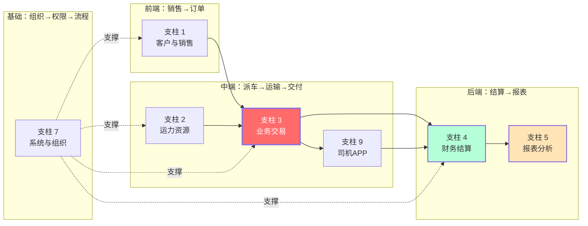

# TMS 功能清单 - 适配版（支柱 1,2,3,4,5,7,9）

> **本文档**：保留的 7 大支柱的详细功能清单，用于 PRD 功能完整度对照  
> **使用说明**：这是"参考清单"，你的项目可以基于此筛选/调整，不要全部照抄  
> **冷链改造注记**：⚠️ 标记表示该功能在冷链项目中需要改造或增强

---

## 支柱 1 · 客户与销售（货主管理）

**目标**：维护客户档案，跟进销售关系，沉淀客户资料。

| 功能子域 | 用户能做什么 |
|---|---|
| 货主档案 | 新建/编辑/查询/删除货主基本信息；按业务负责人、客服负责人分配；启用/禁用；导出 |
| 货主联系人 | 维护多个联系人，标记默认联系人 |
| 开票信息 | 维护多套发票抬头（普票/专票/电子发票） |
| 付款方式 | 维护多种结算方式（月结/票结/即时） |
| 邮寄地址 | 维护票据/物品邮寄地址 |
| 销售跟进 | 录入跟进记录（拜访/电话/邮件） |
| 客户报表 | 客户新增、客户下单、客户毛利、客户应收、客户日报、客户成本 |
| ⚠️ 冷链增强 | **新增字段**：合规要求等级、是否需要温度证明、是否需要溯源报告 |

---

## 支柱 2 · 运力资源（人车挂证）

**目标**：管理司机、车辆、挂车这三大核心资源，以及它们的合规证件。

| 功能子域 | 用户能做什么 |
|---|---|
| 司机管理 | 司机档案 CRUD、经营模式（外协/自有/个体）切换、状态启停、证件审核、银行账户管理、导出 |
| 车辆管理 | 车辆档案 CRUD、经营模式切换、启用/禁用、自有车筛选、关联车辆下拉、导出 |
| 挂车管理 | 挂车档案 CRUD、绑定车辆、批量管理、导出 |
| 车队管理 | 多个车辆组成的车队管理 |
| 维修管理 | 报修登记、维修地点维护、维修费用核算 |
| 保养管理 | 保养计划、保养记录 |
| 审车登记 | 年审到期提醒、登记审车记录 |
| 保险管理 | 商业险/交强险/承运险登记，到期提醒 |
| 到期证件 | 集中查看所有即将到期的证件（行驶证/驾驶证/营运证等） |
| ⚠️ 冷链改造 | **车辆新增字段**：制冷机型号、温区配置、温度传感器列表、部标终端 SN、是否多温区 |
| ⚠️ 冷链改造 | **司机新增字段**：冷链培训证书、GSP 资格证（如医药冷链）、最后一次冷链培训日期 |

---

## 支柱 3 · 业务交易（订单 → 运单 → 签收）

**目标**：完成"客户下单到完成交付"的核心交易闭环。

| 功能子域 | 用户能做什么 |
|---|---|
| 订单管理 | 分页查询/新建/编辑订单；编辑时联动更新关联运单；取消订单；导出 |
| 运单管理 | 创建运单（一对一或一对多基于订单）、编辑运单、查询、详情、作废 |
| 派车调度 | 为运单分配司机/车辆/挂车；分段运输（中转）时分别分配；删除已分配信息 |
| 运输路线 | 配置运输路线模板；运单可更新所走路线 |
| 装卸货 | 装货操作、卸货操作（在司机端 APP 完成） |
| 凭证管理 | 上传/更新/删除运单凭证（装卸照片、磅单、签收单） |
| 回单与派车单 | 上传回单、上传派车单 |
| 箱号铅封 | 集装箱业务的箱号、铅封号维护 |
| 分段运输 | 一票多段时按段分配运力 |
| 标记完成 | 更新运单为"运输完成" |
| 费用维护 | 在运单维度维护各项费用（运费/在途费用） |
| 报表 | 运单利润、车辆运单、运营日报 |
| ⚠️ 冷链新增 | **预冷流程**：派车前必须进行"预冷确认"，APP 中司机确认达标后才能开始 |
| ⚠️ 冷链改造 | **运单新增字段**：温度要求、温区类型、允许超温秒数、温度记录关联 |
| ⚠️ 冷链新增 | **温度采集**：实时接入温度传感器数据，自动关联到运单 |
| ⚠️ 冷链新增 | **超温告警**：触发超温告警时自动推送司机/调度/质控 |
| ⚠️ 冷链改造 | **异常处理**：装卸断链豁免逻辑、超温时长确认、质量异议登记 |

---

## 支柱 4 · 财务结算

**目标**：管理钱的进出，对内对外结算。

| 功能子域 | 用户能做什么 |
|---|---|
| **应付管理** | 应付现金、应付油卡的核算与支付 |
| **应收管理** | 提交核算、应收核算、申请开票、应收核销、应收账款台账 |
| **合同管理** | 合同模板分类、新建/导入合同、状态管理、合同预览/下载、撤销 |
| **费用项目** | 维护费用科目（运费/装卸费/过路费/油费/维修费等） |
| **资金流水** | 银行/现金流水台账 |
| **发票管理** | 开票申请、销项发票登记、进项发票登记 |
| **油卡管理** | 油卡 CRUD、充值、消耗、挂失圈回、副卡分配、油卡交易记录、导出 |
| **ETC 管理** | ETC 卡 CRUD、充值、消耗 |
| **自有车成本** | 自有车基本信息、期初期末、收入（现金/油卡）、支出（现金/油费/ETC/尿素）、费用列表、费用分类、费用与运单关联 |
| ⚠️ 冷链改造 | **应付/应收增强**：加"质量异议"状态、支持冷链计价规则、超温导致的扣款规则 |
| ⚠️ 冷链改造 | **新增费用科目**：制冷成本、温度异常处理费、冷库加时费等 |

---

## 支柱 5 · 报表与分析

**目标**：从交易数据中提炼经营洞察。

| 报表类别 | 维度 |
|---|---|
| **首页统计** | 运营总览、首屏核心指标 |
| **货主报表** | 客户新增、客户下单、客户毛利、客户应收、客户日报、客服成本、客服日报 |
| **运单报表** | 运单利润、车辆运单、运营日报 |
| **自有车报表** | 自有车成本汇总、外调车油卡比例 |
| **员工报表** | 销售成本、销售日报、销售目标、销售应收、员工业务统计 |
| **资金报表** | 资金流水报表 |
| ⚠️ 冷链新增 | **冷链专项报表**：超温率、温度异常事件、SLA 达成率、合规率、预冷完成率 |
| ⚠️ 冷链新增 | **调度大屏**：实时在途运单、温度监控、超温告警、运力动态 |

---

## 支柱 7 · 系统与组织

**目标**：系统的"管理后台"，配置组织、人、权限。

| 子域 | 功能 |
|---|---|
| 员工管理 | 员工 CRUD、启用/禁用、批量调整部门、修改/重置密码、按部门查询 |
| 部门管理 | 部门树 CRUD、查询 |
| 角色管理 | 角色 CRUD、角色-员工绑定（增删查批量）、角色-菜单绑定、角色-数据范围设置 |
| 菜单管理 | 菜单 CRUD、菜单树查询、获取所有请求路径（用于权限点） |
| 数据范围 | 系统级数据范围配置（全公司/部门/本人） |
| 流程审批 | 审批流配置、运单/应付/应收/在途费用等流程实例管理 |
| 登录系统 | 普通登录、第三方登录 |
| 系统日志 | 登录日志、操作日志、更新日志 |
| ⚠️ 冷链新增 | **温度数据审计日志**：所有温度数据的查看/修改操作都要记录（合规要求） |
| ⚠️ 冷链新增 | **多层级组织支持**：总部/分公司/站点的数据隔离 |
| ⚠️ 冷链新增 | **政府监管对接**：部标 808、药监等对接的配置管理 |

---

## 支柱 9 · 移动端（司机端 APP）

**目标**：司机在外作业时的自助操作工具，与管理端实时联动。

| 子域 | 功能 |
|---|---|
| 司机自助 | 查看个人信息、余额、绑定车辆/挂车 |
| 银行账户 | 管理收款银行卡 |
| 运单作业 | 查看待办运单、运单详情、统计已完成数 |
| 凭证上传 | 装卸照片、磅单上传 |
| 在途费用上报 | 现金支出（修车/违章/住宿/停车）、ETC（卡/现金）、油费（卡/现金）、尿素（卡/现金） |
| 在途费用申请 | 现金出车款申请、油卡充值申请 |
| 油卡查询 | 根据车辆查油卡列表、查余额 |
| 通知公告 | 接收平台推送 |
| 意见反馈 | 提交反馈 |
| ⚠️ 冷链新增 | **预冷确认**：派车前司机必须在 APP 中确认预冷温度达标，否则不能开始 |
| ⚠️ 冷链新增 | **温度查看**：司机可实时查看车内温度、温区信息 |
| ⚠️ 冷链新增 | **超温响应**：触发超温告警时，司机可一键"确认异常"、"上报处理" |
| ⚠️ 冷链新增 | **装卸断链标记**：装卸时自动标记"装卸开始""装卸结束"，避免被判为超温 |
| ⚠️ 冷链新增 | **温度证明下载**：运单完成后，司机可下载温度记录证书（用于客户对账） |

---

## 横向对照：按业务环节的完整性检查

**说明**：
- **支柱 3(业务交易)是核心**——其他支柱都为它服务
- **支柱 7(系统与组织)是基础**——所有支柱都需要它来配置权限和流程

---

## 功能优先级建议（为冷链项目 MVP）

### 🔴 P0 - 必做（MVP 上线前）

- [x] 支柱 1：货主、销售跟进、客户报表
- [x] 支柱 2：司机、车辆、基本证件管理 + **冷链改造**（温区、传感器配置）
- [x] 支柱 3：订单、运单、派车、装卸、签收 + **冷链改造**（预冷、温度追踪）
- [x] 支柱 4：应付、应收、成本（基础部分）
- [x] 支柱 7：员工、部门、角色、菜单、基础审批流程
- [x] 支柱 9：司机 APP 基础 + **冷链改造**（预冷确认、温度查看、超温响应）

### 🟡 P1 - 早期迭代（MVP 上线后 1-2 月）

- [ ] 支柱 3：分段运输、异常处理
- [ ] 支柱 4：油卡、ETC、电子签合同
- [ ] 支柱 5：各类报表、首页统计 + **冷链新增**（超温率报表、调度大屏）
- [ ] 支柱 7：流程审批增强、权限细化
- [ ] **冷链新增**：温度报警引擎、冷链溯源基础版

### 🟢 P2 - 后续迭代（V2+）

- [ ] 支柱 4：资金流水、高级合同管理
- [ ] 支柱 5：数据分析、决策支持
- [ ] **冷链新增**：政府监管对接（部标 808/药监）、冷库 WMS、合规留档

---

## 下一步

1. **对照检查**：把这份清单对照你的需求文档，逐项标记"要/不要/改"
2. **冷链融合**：把⚠️ 标记的改造点详细设计，产出"冷链需求融合文档"
3. **PRD 草稿**：基于此清单 + 冷链融合内容，启动 PRD 编写
