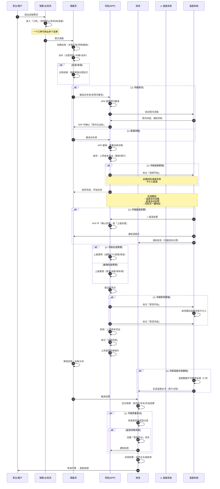
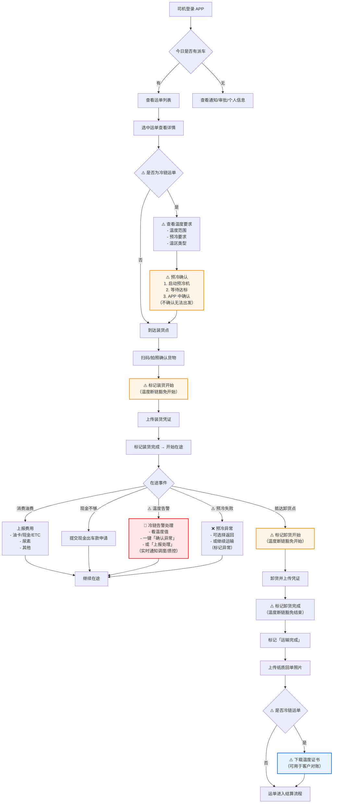
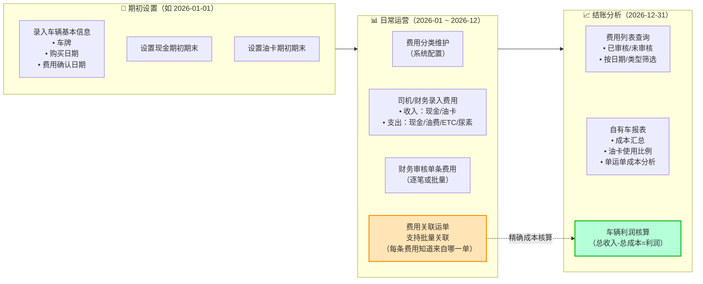
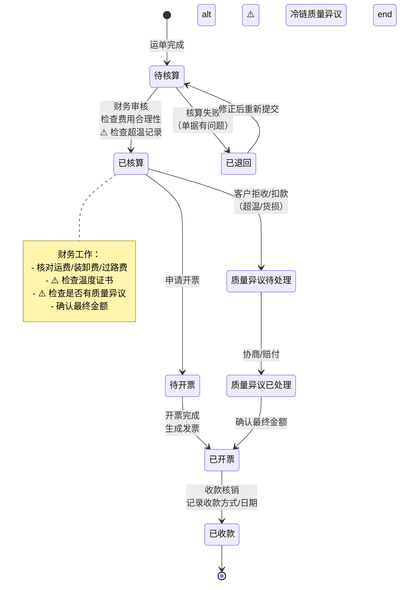
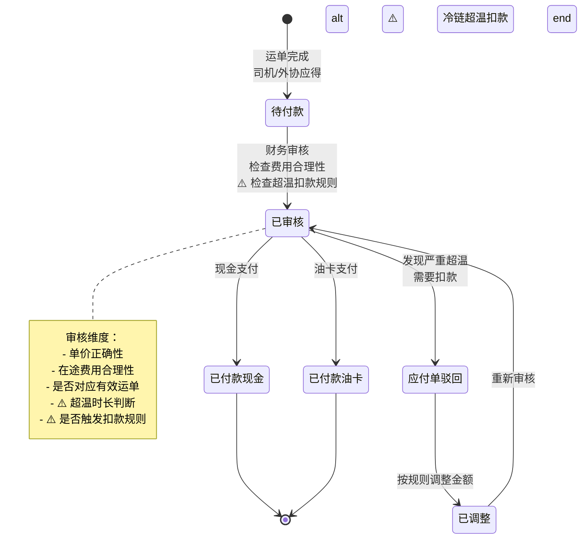
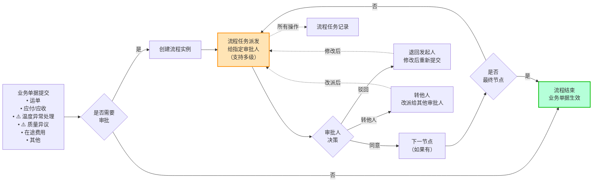

# TMS 核心业务流程图 - 适配版（流程 1,2,3,4,5,8）

> **本文档**：保留的 6 个核心业务流程的 Mermaid 图示 + 冷链改造说明  
> **使用**：作为 PRD 编写、API 设计、状态机设计的参考  
> **⚠️ 冷链注记**：标记处表示冷链项目需要插入的新步骤或改造点

---

## 流程 1 · 主营业务闭环：客户下单 → 完成交付（最核心）

### 🔑 关键节点解析

| 节点 | 普通物流 | 冷链物流（改造点） |
|---|---|---|
| ① 订单录入 | 记录基本信息 | **加字段**：温度要求、合规等级 |
| ② 运单生成 | 拆分运单 | **加关联**：温度阈值、预冷计划 |
| ③ 派车 | 分配司机/车 | **检查**：车辆是否满足温区要求 |
| ④ 预冷（**新增**） | N/A | **冷链独有**：司机必须完成预冷并确认 |
| ⑤ 装货 | 拍照确认 | **新增**：标记装卸开始，温度断链豁免开始 |
| ⑥ 在途 | 上报费用 | **全程贯穿**：温采、告警、司机响应 |
| ⑦ 卸货 | 拍照确认 | **新增**：标记卸货结束，断链豁免结束 |
| ⑧ 完成交付 | 上传回单 | **新增**：生成温度证书、合规留档 |
| ⑨ 结算 | 应付应收 | **改造**：加质量异议流程、超温扣款规则 |

---

## 流程 2 · 司机端 APP 作业流程

### 💡 冷链 APP 设计要点

| 操作点 | 设计细节 |
|---|---|
| **预冷确认** | 非强制完成不能开始运输；记录预冷时间、最终温度 |
| **温度查看** | 实时显示各温区温度、曲线图、与阈值对比 |
| **告警响应** | 告警时弹出"确认/上报"对话框，自动记录响应时间 |
| **断链标记** | 装卸开始/结束时一键标记，系统自动豁免这段时间的超温 |
| **费用上报** | 支持拍照、金额输入、多笔汇总 |
| **温度证书** | 完成后可下载包含"时间/温度/异常"的 PDF 证书 |

---

## 流程 3 · 自有车成本管理流程

### 🎯 冷链改造点

| 改造点 | 原因 |
|---|---|
| **冷藏机组油费单独类目** | 冷链车的发动机油和冷藏机组油要分开计，冷链机组油费才是核心成本 |
| **制冷能耗监控** | 可选：按温区/按车/按时段统计冷藏机组油费 |
| **超温处理费** | 新增费用类目：温度异常导致的处理、客户索赔、品质补偿等 |

---

## 流程 4 · 应收账款流程

### 💼 冷链改造说明

- **冷链新增状态**：「质量异议待处理」→ 处理超温导致的客户拒收或扣款
- **应收冻结**：如果发现严重超温且客户标记异议，应收可暂时冻结等待协商
- **温度证书关联**：每一笔应收单都应关联运单的温度记录

---

## 流程 5 · 应付账款流程（给司机/外协）

### ⚠️ 冷链改造说明

| 改造点 | 说明 |
|---|---|
| **超温扣款规则** | 运单中可配置：超温多少时长开始扣款、扣款比例、最高扣款额 |
| **质量责任判定** | 如果超温导致客户拒收，应付可按比例扣款给司机 |
| **驾驶员告警记录** | 频繁超温的司机，系统可自动预警或降低计费等级 |

---

## 流程 8 · 流程审批引擎（横切能力）

### 🔧 冷链特需的审批场景

| 审批场景 | 审批链 | 备注 |
|---|---|---|
| **温度异常处理** | 质控员 → 财务 → 客服（通知客户） | 严重超温时自动触发 |
| **质量异议** | 客服 → 质控 → 财务 | 客户投诉时手动创建 |
| **应付扣款** | 司机 → 财务主管 | 确认是否合理扣款 |
| **合规留档审批** | 合规审计员 | 确认温度数据是否可归档 |

---

## 流程关键指标追踪（仪表板）

### 🎯 支撑流程 1 的指标

| 指标 | 频率 | 计算逻辑 |
|---|---|---|
| **日订单数** | 日 | COUNT(订单) WHERE 日期 = TODAY |
| **日运单数** | 日 | COUNT(运单) WHERE 创建日期 = TODAY |
| **平均派车时间** | 日 | AVG(派车时间 - 订单创建时间) |
| **完成率** | 日 | COUNT(已完成运单) / COUNT(总运单) |
| **⚠️ 超温率** | 日 | COUNT(有超温告警的运单) / COUNT(冷链运单) |
| **⚠️ 质量异议率** | 日 | COUNT(质量异议) / COUNT(应收单) |

### 📊 支撑流程 2 的指标

| 指标 | 频率 | 说明 |
|---|---|---|
| **司机在线率** | 实时 | 有活跃运单的司机数 / 总司机数 |
| **⚠️ 预冷完成率** | 日 | COUNT(预冷已确认) / COUNT(应预冷运单) |
| **装卸时长** | 运单级 | 装卸结束时间 - 装卸开始时间 |
| **⚠️ 告警响应时间** | 实时 | 告警 → 司机点击「确认」的时间差 |

---

## 下一步实现指南

### 📝 Phase B（需求融合）

1. **对照 SmartTMS 的流程设计**，确认是否都适用
2. **逐个标记⚠️冷链改造点**，详细设计冷链特有逻辑
3. **补充冷链新流程**（如：温度报警处理流程、预冷确认流程）

### 🏗️ Phase C（架构设计）

1. **状态机设计**：运单/应付/应收/温度异常的完整状态图
2. **API 设计**：支持各流程步骤的接口定义
3. **时序图设计**：同步/异步操作，特别是温度采集的实时性

### 💻 Phase D（代码实现）

1. **工作流引擎**：基于 Flowable/activiti 或自研
2. **状态机库**：使用 Spring Statemachine 等
3. **事件驱动**：温度采集、告警触发、消息推送等用事件机制实现
