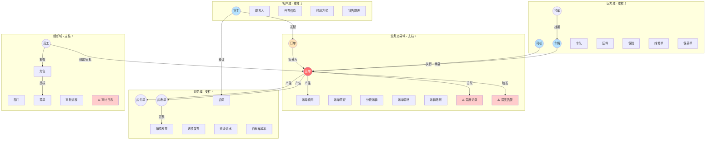

# TMS 领域实体清单 - 适配版

> **本文档**：与保留支柱相关的业务实体清单 + 冷链改造指南  
> **用途**：作为数据库设计、API 设计、数据结构设计的参考  
> **原则**：描述"这个业务对象代表什么"，不描述具体字段名、字段类型

---

## 一、领域全景



---

## 二、客户域（支柱 1）

### 货主（Shipper） 🔑 核心

- **含义**：发起运输需求的客户（B 端为主）
- **关键属性**：基本信息、业务负责人、客服负责人、状态
- **生命周期**：新建 → 启用 → （禁用）→ 删除
- **关联**：1:N 联系人、1:N 开票信息、1:N 付款方式、1:N 订单、1:N 合同

### 联系人（ShipperContact）

- 货主的多个联系人之一，可标记默认
- 属性：姓名、电话、邮箱、职位、地址

### 开票信息（ShipperInvoice）

- 一个货主可以有多套开票抬头
- 属性：公司名、税号、开户行、账号等

### 付款方式（ShipperPaymentWay）

- 月结 / 票结 / 即时 / 预付等
- 属性：方式名、账期天数、信用额度

### 销售跟进（ShipperTrack）

- 销售活动记录
- 属性：跟进人、跟进方式（拜访/电话/邮件）、备注、跟进日期

---

## 三、运力域（支柱 2）

### 司机（Driver） 🔑 核心

- **含义**：实际驾驶人员
- **关键属性**：基本信息、经营模式（自有/外协/个体）、状态、银行账户、关联车辆
- **生命周期**：

```
录入 → 证件审核 → 启用 → （禁用/复用） → 删除
```

- **⚠️ 冷链新增**：冷链培训证书、GSP 资格证、最后培训日期、培训有效期

### 车辆（Vehicle） 🔑 核心

- **含义**：货车主车
- **关键属性**：基本信息、经营模式、状态、关联挂车、绑定油卡/ETC、所属车队
- **生命周期**：与司机类似
- **⚠️ 冷链改造**：
  - 制冷机型号（如：开利、泉州冷机等）
  - 温区配置（单温区/双温区/多温区）
  - 温度传感器列表（传感器 ID、位置、状态）
  - 部标终端 SN（国标定位）
  - 制冷能力（制冷功率、最低可达温度）

### 挂车（Bracket）

- **含义**：可与车辆挂接的拖挂部分
- **关键属性**：基本信息、经营模式、绑定车辆
- **⚠️ 冷链改造**：温区配置、隔热等级

### 车队（Fleet）

- **含义**：车辆的逻辑分组（按地区/品类/项目）
- **关联**：N 个车辆

### 油卡（OilCard）

- **含义**：加油卡（主卡/副卡结构）
- **关键属性**：卡号、绑定车辆、余额、所属公司
- **生命周期**：新建 → 启用 → （挂失圈回） → 注销

### ETC

- 类似油卡，用于高速通行费

### 维修单（RepairOrder）

- 记录车辆维修事项
- 属性：车辆、维修时间、费用、维修点、内容

### 保养单（MaintenanceRecord）

- 记录车辆保养
- 属性：车辆、保养时间、费用、保养项目

### 证件（Certificate）

- 记录需要到期提醒的证件（驾驶证、行驶证、营运证等）
- **⚠️ 冷链新增**：冷链培训证、GSP 资格证

---

## 四、业务交易域（支柱 3）

### 订单（Order） 🔑 核心

- **含义**：客户的"运输需求"，可拆成多个运单
- **关键属性**：货主、货物、起止地、要求时间、订单金额、状态
- **生命周期**：已创建 → 已分配 → 进行中 → 已完成 / 已取消

### 运单（Waybill） ⭐ **绝对核心**

- **含义**：一段具体的运输任务
- **关键属性**：关联订单、货主、司机、车辆、挂车、路线、费用、凭证、状态
- **关联**：1:N 货物、1:N 费用、1:N 凭证、1:N 异常、1:N 分段
- **生命周期**：

```
待派车 → 已派车 → 装货中 → 在途 → 卸货中 → 已签收 → 已完成 → 已结算
```

- **⚠️ 冷链改造**：
  - 温度要求（温度范围、允许超温秒数、温区类型）
  - 预冷要求（是否需要预冷、预冷温度、预冷时长）
  - 关联的温度记录 ID 列表
  - 超温告警列表
  - 装卸时间戳（装卸开始、装卸结束、卸货开始、卸货结束）

### 运单货物（WaybillGoods）

- 一个运单可载多种货物
- **⚠️ 冷链新增**：货物温度区间、合规等级（GSP/食品/普货）、允许超温阈值

### 运单费用（WaybillCost）

- 一个运单的所有费用条目
- 类型：运费、装卸、过路、油费、维修费等
- **⚠️ 冷链新增**：制冷费、异常处理费、超温赔付等

### 运单凭证（WaybillVoucher）

- 装卸照片、磅单、回单、派车单、温度证书（⚠️ 新增）

### 分段运输（WaybillSplitTransport）

- 一票多段时，每段单独的运力分配

### 运单异常（WaybillException）

- 运输中发生的异常事件（事故、延误、货损、超温等）
- **⚠️ 冷链改造**：新增"超温异常"类型、"装卸断链豁免"标记

### ⚠️ 温度记录（TempRecord） - **冷链独有**

- **含义**：时序数据，运输全程的温度采集记录
- **关键属性**：关联运单、采集时间、各温区温度、采集来源（传感器 ID）
- **关联**：N:1 运单、N:1 温度阈值
- **存储方案**：建议用时序数据库（TimescaleDB/TDengine/InfluxDB），不要塞 MySQL
- **数据保留**：冷链必须 5 年不可篡改存储

### ⚠️ 温度告警（TempAlarm） - **冷链独有**

- **含义**：触发超温告警时的记录
- **关键属性**：关联运单、告警时间、超温温度、阈值、告警等级、司机响应状态、响应时间
- **状态**：新增 → 通知中 → 司机已确认 / 处理中 → 已处理

### 运输路线（Route）

- 路线模板，可被运单引用
- 属性：起点、终点、距离、预计时长、途经关键点

---

## 五、财务域（支柱 4）

### 应付单（PayOrder）

- **含义**：要付给司机/外协/供应商的钱
- **关键属性**：关联运单、收款人、金额、状态
- **生命周期**：待审核 → 已审核 → 已付款 / 已驳回
- **⚠️ 冷链改造**：
  - 加"质量异议"状态处理
  - 支持超温扣款规则配置（超温多少秒开始扣款、扣款比例）

### 应收单（ReceiveOrder）

- **含义**：要向货主收的钱
- **关键属性**：关联运单、收款方、金额、状态
- **生命周期**：待核算 → 已核算 → 待开票 → 已开票 → 已收款 / 质量异议待处理
- **⚠️ 冷链新增**：质量异议状态、温度证书关联

### 销项发票（ReceiveOrderInvoice）

- 应收对应的发票
- 属性：发票号、开票日期、金额、收款状态

### 进项发票（OA-Invoice）

- 公司收到的发票（油卡/过路费/采购）

### 合同（Contract）

- **含义**：与货主或司机签订的服务合同
- **关键属性**：模板类型、签署方、状态、电子签信息
- **⚠️ 冷链新增**：合同中应包含"温度异常责任条款"模板

### 资金流水（CapitalFlow）

- 银行/现金的所有进出记录
- 属性：流水类型、金额、时间、摘要

### 自有车成本（CarCost*）

- 一组实体：基本信息、期初期末、收入、支出、费用列表、费用分类
- **核心设计**：每条费用可关联到具体运单，精确核算单运单成本
- **⚠️ 冷链改造**：支持"制冷成本"单独类目和统计

---

## 六、组织域（支柱 7）

### 员工（Employee）

- 含义：内部用户
- 状态：启用/禁用
- 关联：N:N 角色、1:1 部门、1:1 直接上级

### 部门（Department）

- 树形结构
- **⚠️ 冷链新增**：支持多层级（总部/分公司/站点）

### 角色（Role）

- N:N 员工、N:N 菜单、N:N 数据范围
- **⚠️ 冷链新增**：可新增"品控员""合规审计员"等冷链特色角色

### 菜单（Menu）

- 树形结构，对应 UI 路由 + 权限点

### 数据范围（DataScope）

- 系统级配置：全公司/部门/本人/多级组织等
- **⚠️ 冷链新增**：支持"客户自有数据"隔离（司机只看自己的运单温度）

### 审批流程（FlowDef + FlowInstance + FlowTask）

- **3 层结构**：
  - FlowDef：流程定义（模板）
  - FlowInstance：流程实例（一次审批）
  - FlowTask：节点任务（具体某人要审的事）

### ⚠️ 审计日志（AuditLog） - **冷链特需**

- **含义**：记录温度数据、敏感操作的访问和修改
- **关键属性**：操作人、操作时间、操作类型、数据变化前后值、IP 地址
- **用途**：合规留档、溯源证明、审计需求

---

## 七、冷链独有实体（MVP 后续）

### ⚠️ 温度阈值（TempThreshold） - **V1 必做**

- **含义**：每种货物/温区的允许温度范围
- **关键属性**：名称、温度范围（最低-最高）、允许超温秒数、告警级别
- **关联**：1:N 货物类型、1:N 客户

### ⚠️ 多温区（TempZone） - **V1 必做**

- **含义**：车辆/冷库内的温度分区配置
- **关键属性**：温区名、编号、温度范围、物理位置
- **关联**：N:N 车辆、N:N 仓库

### ⚠️ 预冷记录（PreCoolRecord） - **V1 必做**

- **含义**：车辆/仓库预冷过程记录
- **关键属性**：预冷开始时间、预冷结束时间、预冷后最终温度、是否达标、司机确认状态

### ⚠️ 车载终端（OBU/IoTDevice） - **V1 必做**

- **含义**：IoT 设备档案
- **关键属性**：设备 ID、设备型号、关联车辆、激活状态、最后心跳时间
- **用途**：温度采集、部标 808 报送

### ⚠️ 冷链溯源（TraceabilityChain） - **V2 可选**

- **含义**：整票货从仓→车→客的全程留痕
- **关键属性**：关联运单、出发地/目的地、经过的所有地点、各环节的温度、相关人员、时间戳

### ⚠️ 合规留档（ComplianceArchive） - **V1 必做**

- **含义**：不可篡改的温度档案（5 年保存）
- **关键属性**：关联运单、完整温度曲线、异常记录、对应证书、生成时间、签名/哈希值
- **存储**：建议与温度记录分离存储（关键数据单独库）

---

## 八、领域关键关系

### 1:N 关系

```
货主 1 ---> N 联系人/发票/订单/合同
司机 1 ---> N 运单（执行的）
车辆 1 ---> N 运单（承载的）
订单 1 ---> N 运单（拆分的）
运单 1 ---> N 费用/凭证/异常/分段
应付单 N <--- 1 运单
应收单 N <--- 1 运单
```

### N:N 关系

```
员工 N <---> N 角色
角色 N <---> N 菜单
角色 N <---> N 数据范围
温度记录 N <---> 1 温度阈值
```

---

## 九、冷链改造清单（快速参考）

### 📝 新增实体（必做）

- [ ] 温度记录（TempRecord）
- [ ] 温度告警（TempAlarm）
- [ ] 温度阈值（TempThreshold）
- [ ] 多温区（TempZone）
- [ ] 预冷记录（PreCoolRecord）
- [ ] 车载终端（OBU/IoTDevice）
- [ ] 审计日志（AuditLog）
- [ ] 合规留档（ComplianceArchive）

### 🔄 改造现有实体

| 实体 | 新增字段/关联 |
|---|---|
| 司机 | 冷链培训证、GSP 资格、培训有效期 |
| 车辆 | 制冷机型号、温区配置、传感器列表、部标终端 |
| 挂车 | 温区配置、隔热等级 |
| 货物 | 温度区间、超温阈值、合规等级 |
| 货主 | 合规要求等级、是否需要溯源 |
| 运单 | 温度要求、预冷要求、温度记录关联、装卸时间戳 |
| 应付单 | 质量异议状态、扣款规则 |
| 应收单 | 质量异议状态、温度证书关联 |

### 🏢 改造现有角色

- [ ] 新增：品控员
- [ ] 新增：合规审计员
- [ ] 新增：仓库主管
- [ ] 新增：客户审计员（客户方权限）

---

## 十、下一步行动

### Phase B（需求融合）

1. **实体验证**：逐个确认这些实体是否适用你的业务
2. **字段设计**：补充具体字段名、类型、校验规则
3. **关系梳理**：补充遗漏的 1:N 或 N:N 关系

### Phase C（架构设计）

1. **库设计**：决定时序数据库、主库、审计库的分离方案
2. **API 设计**：为每个实体设计 CRUD + 业务操作接口
3. **缓存策略**：哪些实体需要缓存、缓存失效策略

### Phase D（代码实现）

1. **ORM 映射**：数据库表 ↔ 代码实体
2. **数据验证**：字段级验证、业务规则验证
3. **事件发布**：关键操作触发事件（温度告警、异常创建等）
