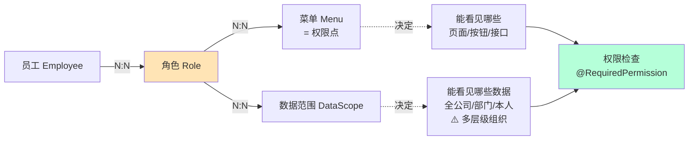

# TMS 角色权限矩阵 - 适配版

> **本文档**：保留的 7+ 个角色与保留功能的权限矩阵，用于权限系统设计参考  
> **图例**：✅ 全部 / 🟡 部分 / 👀 仅查看 / ❌ 无 / 📱 仅 APP

---

## 一、识别出的角色（7 个基础 + 冷链扩展）

### 基础角色（SmartTMS 保留）

| 序号 | 角色名 | 描述 | 工作场景 |
|---|---|---|---|
| 1 | 超级管理员 | 系统全局配置、权限管理 | 不参与业务，系统维护 |
| 2 | 业务主管 | 部门主管、看大盘报表、审批关键决策 | 管理层决策 |
| 3 | 销售员 | 维护货主、接单、跟进 | 前端销售 |
| 4 | 调度员 | 派车、运单管理、监控在途 | 中端运营 |
| 5 | 客服 | 处理货主咨询、跟单 | 前端服务 |
| 6 | 司机 | 接单、装卸、上报费用 | 后端执行（APP）|
| 7 | 财务 | 应付应收、对账、开票 | 财务结算 |

### ⚠️ 冷链扩展角色（可选，V1+ 考虑）

| 序号 | 角色名 | 描述 | 新增权限 |
|---|---|---|---|
| 8 | 品控员 | 质量监控、温度审核、异常处理 | 审核温度数据、处理超温告警、确认质量异议 |
| 9 | 合规审计员 | 合规留档、政府监管对接 | 审计温度数据、导出合规证书、审计日志查看 |
| 10 | 仓库主管 | 冷库出入库、预冷监督 | WMS 操作、库温监控、预冷审核 |

---

## 二、详细权限矩阵（保留支柱功能）

> **注**：⚠️ 标记表示冷链项目的改造/扩展点

### A. 客户管理（支柱 1）

| 功能 | 超管 | 主管 | 销售 | 调度 | 客服 | 司机 | 财务 | ⚠️ 品控 | ⚠️ 合规 |
|---|---|---|---|---|---|---|---|---|---|
| 货主 CRUD | ✅ | ✅ | ✅ | 👀 | 👀 | ❌ | 👀 | ❌ | 👀 |
| 货主开票/付款 | ✅ | ✅ | ✅ | ❌ | ❌ | ❌ | ✅ | ❌ | ❌ |
| 货主跟进 | ✅ | ✅ | ✅ | ❌ | ✅ | ❌ | ❌ | ❌ | ❌ |
| ⚠️ 货主合规等级查看 | ✅ | ✅ | ✅ | ✅ | ✅ | ❌ | ✅ | ✅ | ✅ |

### B. 运力管理（支柱 2）

| 功能 | 超管 | 主管 | 销售 | 调度 | 客服 | 司机 | 财务 | ⚠️ 品控 | ⚠️ 合规 |
|---|---|---|---|---|---|---|---|---|---|
| 司机 CRUD | ✅ | ✅ | ❌ | ✅ | 👀 | 👀本人 | 👀 | 👀 | 👀 |
| ⚠️ 司机冷链证审核 | ✅ | ✅ | ❌ | ✅ | ❌ | ❌ | 👀 | ✅ | ✅ |
| 车辆 CRUD | ✅ | ✅ | ❌ | ✅ | 👀 | 👀关联 | 👀 | 👀 | 👀 |
| ⚠️ 车辆温区配置 | ✅ | ✅ | ❌ | ✅ | ❌ | ❌ | ❌ | ✅ | ✅ |
| ⚠️ 车载终端管理 | ✅ | ✅ | ❌ | ✅ | ❌ | ❌ | ❌ | 👀 | ✅ |
| 挂车 CRUD | ✅ | ✅ | ❌ | ✅ | 👀 | ❌ | 👀 | ❌ | 👀 |
| 维修/保养/审车 | ✅ | ✅ | ❌ | 🟡 | ❌ | ❌ | 👀 | ❌ | ❌ |
| 证件到期提醒 | ✅ | ✅ | ❌ | ✅ | ❌ | ❌ | 👀 | ❌ | ✅ |

### C. 业务交易（支柱 3）

| 功能 | 超管 | 主管 | 销售 | 调度 | 客服 | 司机 | 财务 | ⚠️ 品控 | ⚠️ 合规 |
|---|---|---|---|---|---|---|---|---|---|
| 订单 CRUD | ✅ | ✅ | ✅ | ✅ | 🟡 | ❌ | 👀 | ❌ | 👀 |
| 运单 CRUD | ✅ | ✅ | 👀 | ✅ | 🟡 | 📱查看 | 👀 | 👀 | 👀 |
| 派车（分配司机/车） | ✅ | 🟡 | ❌ | ✅ | ❌ | ❌ | ❌ | ❌ | ❌ |
| ⚠️ 派车前检查温区 | ✅ | ✅ | ❌ | ✅ | ❌ | ❌ | ❌ | ✅ | ❌ |
| ⚠️ 预冷计划录入 | ✅ | ✅ | ❌ | ✅ | ❌ | ❌ | ❌ | 🟡 | ❌ |
| 装卸操作 | ❌ | ❌ | ❌ | ❌ | ❌ | ✅📱 | ❌ | ❌ | ❌ |
| ⚠️ 装卸断链标记 | ❌ | ❌ | ❌ | 🟡 | ❌ | ✅📱 | ❌ | ✅ | ❌ |
| 凭证上传 | ✅ | 👀 | 👀 | 🟡 | 🟡 | ✅📱 | 👀 | 🟡 | 👀 |
| ⚠️ 温度数据查看 | ✅ | ✅ | ❌ | ✅ | 🟡 | ✅📱 | 👀 | ✅ | ✅ |
| ⚠️ 超温告警查看 | ✅ | ✅ | ❌ | ✅ | 🟡 | ✅📱 | 👀 | ✅ | ✅ |
| ⚠️ 超温告警处理 | ✅ | ✅ | ❌ | ✅ | 🟡 | ✅📱 | ❌ | ✅ | 👀 |
| 运单异常处理 | ✅ | ✅ | 👀 | ✅ | 🟡 | 🟡 | 👀 | 🟡 | 👀 |

### D. 财务结算（支柱 4）

| 功能 | 超管 | 主管 | 销售 | 调度 | 客服 | 司机 | 财务 | ⚠️ 品控 | ⚠️ 合规 |
|---|---|---|---|---|---|---|---|---|---|
| 应付管理 | ✅ | 👀 | ❌ | ❌ | ❌ | ❌ | ✅ | ❌ | 👀 |
| ⚠️ 应付质量异议 | ✅ | ✅ | ❌ | ❌ | ❌ | ❌ | ✅ | ✅ | 👀 |
| ⚠️ 应付扣款规则配置 | ✅ | 🟡 | ❌ | ❌ | ❌ | ❌ | ✅ | ❌ | ❌ |
| 应收管理 | ✅ | 👀 | 👀 | ❌ | ❌ | ❌ | ✅ | 👀 | 👀 |
| ⚠️ 应收质量异议 | ✅ | ✅ | 🟡 | ❌ | ✅ | ❌ | ✅ | ✅ | 👀 |
| 合同/电子签 | ✅ | ✅ | ✅ | ❌ | ❌ | ❌ | ✅ | ❌ | 👀 |
| 油卡管理 | ✅ | 👀 | ❌ | 👀 | ❌ | 👀 | ✅ | ❌ | ❌ |
| 油卡充值审批 | ✅ | ✅ | ❌ | 🟡 | ❌ | 📱申请 | ✅ | ❌ | ❌ |
| 自有车成本 | ✅ | 👀 | ❌ | 🟡 | ❌ | 📱录入 | ✅ | ❌ | ❌ |
| 资金流水 | ✅ | 👀 | ❌ | ❌ | ❌ | ❌ | ✅ | ❌ | 👀 |

### E. 报表分析（支柱 5）

| 功能 | 超管 | 主管 | 销售 | 调度 | 客服 | 司机 | 财务 | ⚠️ 品控 | ⚠️ 合规 |
|---|---|---|---|---|---|---|---|---|---|
| 首页统计 | ✅ | ✅ | 🟡 | 🟡 | 🟡 | ❌ | 🟡 | 🟡 | 🟡 |
| 货主报表 | ✅ | ✅ | ✅本人 | 👀 | ✅本人 | ❌ | ✅ | 👀 | 👀 |
| 运单报表 | ✅ | ✅ | 🟡 | ✅ | 🟡 | ❌ | ✅ | ✅ | 👀 |
| ⚠️ 温度报表 | ✅ | ✅ | ❌ | 🟡 | ❌ | ❌ | 👀 | ✅ | ✅ |
| ⚠️ 超温统计 | ✅ | ✅ | ❌ | ✅ | ❌ | ❌ | 👀 | ✅ | ✅ |
| ⚠️ SLA 达成率 | ✅ | ✅ | ❌ | ✅ | ❌ | ❌ | 👀 | ✅ | 👀 |
| ⚠️ 调度大屏 | ✅ | ✅ | ❌ | ✅ | ❌ | ❌ | 👀 | 👀 | ❌ |
| 财务报表 | ✅ | ✅ | ❌ | ❌ | ❌ | ❌ | ✅ | ❌ | 👀 |
| 员工报表 | ✅ | ✅ | ✅本人 | ✅本人 | ✅本人 | ❌ | ✅ | ❌ | ❌ |

### F. 系统与组织（支柱 7）

| 功能 | 超管 | 主管 | 销售 | 调度 | 客服 | 司机 | 财务 | ⚠️ 品控 | ⚠️ 合规 |
|---|---|---|---|---|---|---|---|---|---|
| 员工/部门/角色 | ✅ | ❌ | ❌ | ❌ | ❌ | ❌ | ❌ | ❌ | ❌ |
| 菜单/权限 | ✅ | ❌ | ❌ | ❌ | ❌ | ❌ | ❌ | ❌ | ❌ |
| 流程审批配置 | ✅ | 🟡 | ❌ | ❌ | ❌ | ❌ | ❌ | ❌ | ❌ |
| ⚠️ 流程审批实例管理 | ✅ | ✅ | ❌ | ✅ | ✅ | ❌ | ✅ | ✅ | 👀 |
| ⚠️ 超温处理流程审批 | ✅ | ✅ | ❌ | ✅ | ✅ | ❌ | ✅ | ✅ | ❌ |
| ⚠️ 质量异议流程审批 | ✅ | ✅ | 🟡 | ❌ | ✅ | ❌ | ✅ | ✅ | ❌ |
| 系统日志 | ✅ | ❌ | ❌ | ❌ | ❌ | ❌ | ❌ | ❌ | ❌ |
| ⚠️ 审计日志查看 | ✅ | 👀 | ❌ | ❌ | ❌ | ❌ | 👀 | ❌ | ✅ |
| ⚠️ 温度数据审计 | ✅ | ❌ | ❌ | ❌ | ❌ | ❌ | ❌ | ❌ | ✅ |

### G. 移动端（支柱 9 - 司机 APP）

| 功能 | 司机 | ⚠️ 调度员 H5 | ⚠️ 客服 H5 |
|---|---|---|---|
| 司机 APP 登录 | ✅ | N/A | N/A |
| 查看个人信息 | ✅ | ✅ | ✅ |
| 查看待办运单 | ✅ | ❌ | ❌ |
| 运单详情查看 | ✅ | ✅ | 👀 |
| ⚠️ 预冷确认 | ✅ | ❌ | ❌ |
| ⚠️ 温度查看（实时） | ✅ | ✅ | 👀 |
| ⚠️ 温度告警响应 | ✅ | ❌ | ❌ |
| ⚠️ 装卸断链标记 | ✅ | 👀 | ❌ |
| 装卸凭证上传 | ✅ | ❌ | ❌ |
| 在途费用上报 | ✅ | ❌ | ❌ |
| 在途费用申请 | ✅ | ❌ | ❌ |
| 油卡查询 | ✅ | ❌ | ❌ |
| ⚠️ 温度证书下载 | ✅ | ✅ | 👀 |
| 通知公告 | ✅ | ✅ | ✅ |
| 意见反馈 | ✅ | ✅ | ✅ |

---

## 三、权限实现机制



### 4 层结构（SmartTMS 方式）

1. **员工 ↔ 角色**：一个员工可多角色
2. **角色 ↔ 菜单**：角色决定能访问什么页面/接口
3. **角色 ↔ 数据范围**：决定能看什么范围的数据
4. **菜单 ↔ 请求路径**：菜单背后对应到具体后端 API 路径

### 数据范围典型配置

| 范围类型 | 说明 | 适用角色 |
|---|---|---|
| **全公司** | 能看到所有数据 | 超级管理员、业务主管 |
| **本部门** | 只能看本部门创建的数据 | 部门主管、销售 |
| **仅本人** | 只能看自己创建/经手的数据 | 销售员、调度员 |
| **⚠️ 多层级** | 总部 → 分公司 → 站点的树形隔离 | 区域经理、站点经理 |
| **⚠️ 客户隔离** | 司机只看自己的运单数据 | 司机 |

---

## 四、冷链项目权限增强

### ✅ 可借鉴的做法

1. **「角色 + 菜单 + 数据范围」三件套**：成熟的 RBAC，继续用
2. **菜单 → 权限点**的映射：粒度足够细
3. **数据范围解耦**：把"能看见什么"和"能操作什么"分开

### ⚠️ 冷链项目需要的增强点

| 增强点 | 实现方案 |
|---|---|
| **支持多层级数据隔离**（总部/分公司/站点） | 在 DataScope 中扩展树形支持，而不是现有的 4 种扁平类型 |
| **司机自有数据隔离** | 司机角色的 DataScope 自动过滤为"仅自己的运单" |
| **温度数据特殊权限** | 温度数据是合规留档，修改权限严格控制（仅超管+合规员），所有操作记审计日志 |
| **字段级权限** | 例如：客服看运单但不看金额；可考虑用标签注解实现 |
| **客户自助查询** | 新增客户端账号，只能查自己的订单/运单/温度数据 |

### 新增的冷链角色详解

#### ⚠️ 品控员（QA/Quality Inspector）

| 维度 | 权限 |
|---|---|
| **温度数据** | 查看、审核、标记异常、导出 |
| **超温告警** | 查看告警列表、确认处理、标记质量异议 |
| **运单** | 查看所有运单的温度和异常情况 |
| **报表** | 查看温度报表、超温统计、SLA 达成率 |
| **流程审批** | 参与"超温处理""质量异议"流程审批 |
| **不能做** | 修改温度数据、修改扣款规则 |

#### ⚠️ 合规审计员（Compliance Officer）

| 维度 | 权限 |
|---|---|
| **温度数据** | 查看、导出、审计（只读，不能修改） |
| **合规留档** | 查看/下载合规证书、审计签名 |
| **审计日志** | 查看所有操作日志（谁修改了什么，什么时候） |
| **报表** | 查看合规率、历史异常、温度趋势 |
| **政府对接** | 查看/导出政府监管所需的数据 |
| **不能做** | 修改任何业务数据、参与审批决策 |

#### ⚠️ 仓库主管（Warehouse Manager）

| 维度 | 权限 |
|---|---|
| **冷库管理** | 查看冷库温区、库温实时监控 |
| **预冷计划** | 查看预冷计划、审核预冷完成 |
| **入出库** | 操作入出库单据 |
| **库温报表** | 查看冷库温度趋势、异常预警 |
| **不能做** | 运单派车、财务操作 |

---

## 五、权限检查要点（开发指南）

### 后端权限检查

```
1. 验证用户登录状态
2. 获取用户所有角色
3. 从角色获取所有菜单（权限点）
4. 从角色获取数据范围
5. 检查请求的接口是否在权限点内
6. 检查数据ID是否在数据范围内
7. 记录操作到审计日志（如果涉及温度数据）
```

### 前端权限检查

```
1. 获取用户权限列表
2. 动态渲染菜单（隐藏无权限菜单）
3. 动态禁用/隐藏无权限按钮
4. 列表数据按数据范围过滤
```

### ⚠️ 冷链特殊检查

```
1. 温度数据查看：额外检查用户角色是否包含"温度数据查看权限"
2. 温度数据修改：只允许超管 + 合规员操作，所有操作记审计日志
3. 应付扣款：检查是否超过规则配置的最高扣款额
4. 多层级组织：确保数据范围过滤支持树形结构
```

---

## 六、权限矩阵使用清单

### Phase B（需求融合）

- [ ] 确认这 7 个基础角色是否覆盖你的业务
- [ ] 确认是否需要新增冷链角色（品控员、合规员等）
- [ ] 确认数据范围的隔离方式（平面 vs 树形）
- [ ] 确认是否需要客户侧自助账号

### Phase C（架构设计）

- [ ] 设计权限检查的拦截器/中间件
- [ ] 设计数据范围过滤的 SQL 生成逻辑
- [ ] 设计审计日志的记录时机和字段
- [ ] 设计权限变更时的缓存失效策略

### Phase D（代码实现）

- [ ] 实现 RBAC 系统（员工、角色、菜单、数据范围的 CRUD）
- [ ] 实现权限拦截（注解 or 中间件）
- [ ] 实现审计日志记录（特别是温度数据操作）
- [ ] 实现多层级组织的数据隔离逻辑
- [ ] 为每个角色编写单元测试（权限边界测试）

---

## 七、快速参考

### 各角色的核心权限

| 角色 | 核心权限 | 核心限制 |
|---|---|---|
| **超管** | 一切 | 无 |
| **主管** | 业务决策、审批、报表查看 | 不能系统配置、不能删除数据 |
| **销售** | 货主/订单 CRUD、跟进、本人报表 | 只看本人负责的客户 |
| **调度** | 运单 CRUD、派车、在途监控 | 不能修改财务、不能删除 |
| **客服** | 订单/运单查看、异常处理、客户沟通 | 不能派车、不能财务操作 |
| **司机** | APP：待办查看、装卸、费用上报 | 只看自己的运单 |
| **财务** | 应付应收 CRUD、发票、报表 | 不能修改运单、不能删除 |
| **⚠️ 品控** | 温度查看、告警确认、异常标记 | 不能修改温度、不能扣款 |
| **⚠️ 合规** | 温度查看(只读)、审计日志、合规证书 | 不能修改任何业务数据 |

---

**下一步**：基于这份矩阵，依次为每个角色编写权限测试用例，确保系统发布前权限体系完整。
